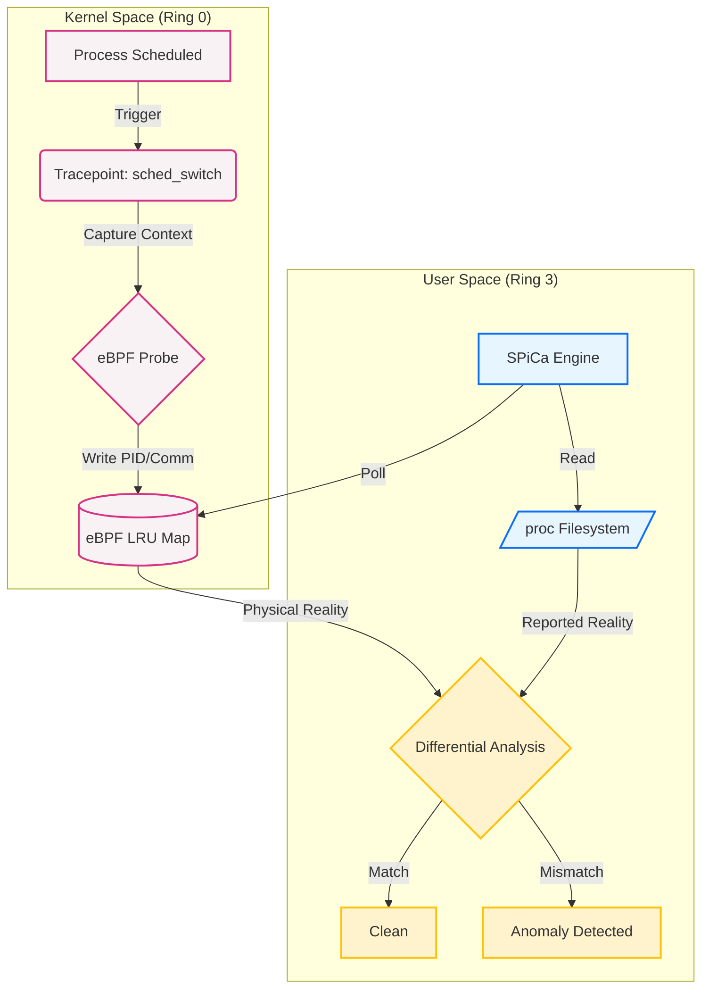

# SPiCa
**System Process Integrity & Cross-view Analysis**

> "I'm going to sing, so shine bright, SPiCa..."

SPiCa is a high-performance, eBPF-based rootkit detection engine written in Rust. inspired by the hatsune miku song SPiCa which represents hatsune miku as a star watching all over us, SPiCa in general terms is a binary star; two stars spinning around eachother forming a bright star, It enforces **Kernel Sovereignty** by establishing a ground truth based on CPU execution rather than relying on potentially compromised system APIs.

By implementing a **Cross-View Differential** architecture, SPiCa detects sophisticated evasion techniques—including Direct Kernel Object Manipulation (DKOM) and PID Hollowing—in real-time with negligible system overhead.

## Architecture

SPiCa operates on a "Binary Star" principle, maintaining two distinct observational vantages to identify discrepancies in system state:

1.  **The Kernel View (Ground Truth):**
    Utilizes an eBPF probe hooked into the `sched_switch` tracepoint. This captures the raw execution context of every process the moment it touches the CPU, bypassing the Virtual File System (VFS) and standard syscall tables.

2.  **The User View (Reported Reality):**
    Queries standard system APIs (`/proc` filesystem) to retrieve the list of processes the Operating System *claims* are running.

3.  **The Differential Engine:**
    A userspace Finite State Machine (FSM) synchronizes these two views. Any process execution observed in the Kernel that lacks a corresponding entry in the User View is flagged as an anomaly.



## Detection Logic

> [!WARNING]
> **DEVELOPMENT STATUS:** The **Masquerade Detection** (PID Hollowing) module is currently under active construction. While the eBPF hooks are in place, the userspace verification logic is not yet fully implemented in `v1.0`. Expect this feature to land in `v1.2`.

The engine classifies process states based on the coherence between the Scheduler and the Filesystem:

* **CLEAN:** The process executes on the CPU and is correctly reported by the OS.
* **SUSPECT:** A transient state where a process appears in the Kernel but is missing from User space. This triggers a debounce mechanism to filter out short-lived processes (race conditions).
* **GHOST (DKOM):** A process is confirmed to be consuming CPU cycles but is persistently invisible to system enumeration tools (e.g., `ps`, `top`). This indicates an active rootkit hiding presence.
* **MASQUERADE (PID Hollowing):** The process name recorded by the Scheduler differs from the name reported by the filesystem, indicating that a legitimate process structure has been hijacked.

## Technology Stack

* **Language:** Rust (Memory safety and performance)
* **Orchestration:** Aya (eBPF library for Rust)
* **Instrumentation:** `tracepoint/sched/sched_switch`
* **Memory Management:** Per-CPU LRU HashMaps for lock-free, high-throughput data shared between Kernel and User space.
* **Verification:** Implements active liveness checks (`kill(0)`) to garbage collect terminated processes and prevent false positives.

## Prerequisites

dependencies:

```shell
sudo apt update && sudo apt install -y build-essential linux-headers-$(uname -r) libelf-dev clang llvm
```

To build SPiCa, you need a Rust toolchain capable of compiling BPF bytecode.

1.  **Stable Rust:** `rustup toolchain install stable`
2.  **Nightly Rust:** `rustup toolchain install nightly --component rust-src && rustup override set nightly` (Required for `-Z build-std`)
3.  **BPF Linker:** `cargo install bpf-linker`

## Build & Run

1.  **Compile the eBPF Kernel Probe and User Agent:**

```shell
    cargo run --package xtask build-ebpf --release
```

2.  **Run the Detector:**
    ```shell
    sudo ./target/release/spica
    ```

## License

This project is licensed under the [GNU General Public License, Version 2](LICENSE-GPL2).
