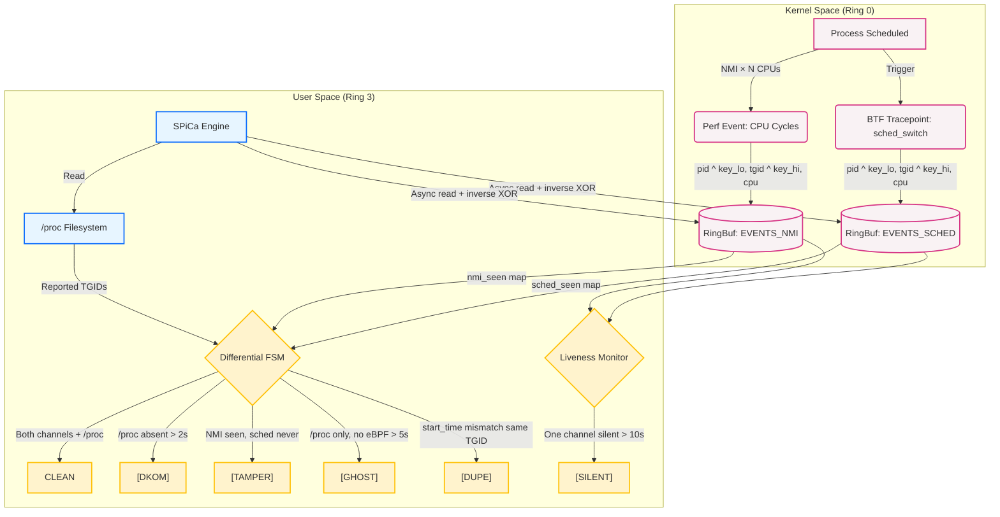

# SPiCa
**System Process Integrity & Cross-view Analysis**

<p align="center">
  
</p>

> "I'm going to sing, so shine bright, SPiCa..."

SPiCa is a high-performance, eBPF-based rootkit detection engine written in Rust. The name comes from two places at once: the Hatsune Miku song *SPiCa*, and the real star it is named after — Spica (Alpha Virginis), the brightest star in Virgo. Spica is not a single star. It is a **spectroscopic binary**: two massive stars locked in a mutual orbit so tight they are pulled into egg shapes by each other's gravity, completing a full revolution every four days, indistinguishable to the naked eye as anything other than one.

> **⚠️ Disclaimer:** Significant portions of this codebase were generated or refactored using Claude Code. While rigorous testing and iterative trial and error were conducted to ensure accuracy and architectural integrity, the code should still be reviewed for security and performance before production use.

SPiCa the detector is built on the same principle. It is architecturally a **binary star**: two independent observation channels orbiting the same process space, each anchored to a different physical mechanism, forming a detection system that cannot be silenced by attacking a single channel.

SPiCa enforces **Kernel Sovereignty** by establishing ground truth from CPU execution events and direct kernel memory reads (BTF/CO-RE), deliberately bypassing helper functions that a rootkit can hook.

SPiCa maintains two independent observational channels and a userspace differential engine:

### Channel 1 — BTF Tracepoint (sched_switch)

An eBPF program attached to the kernel's `sched_switch` BTF tracepoint fires every time a process is scheduled onto a CPU. Instead of using `bpf_get_current_pid_tgid()` (which returns the *outgoing* task and is hookable), SPiCa reads the incoming `task_struct *next` pointer directly via CO-RE (`bpf_probe_read_kernel`), extracting `pid`, `tgid`, and `comm` from kernel memory. Events are pushed to userspace via RingBuf.

### Channel 2 — NMI Perf Event (hardware CPU cycle counter)

A second eBPF program fires via **Non-Maskable Interrupt** (NMI) driven by the hardware PMU cycle counter, attached independently to every logical CPU. NMIs cannot be masked by `cli`/`sti` in software — suppressing this channel requires reprogramming model-specific PMU registers (a hardware-level, privileged operation). This channel is therefore resistant to the software hooking attacks that defeat commercial EDR products.

### Obfuscation Layer — Build-Time Per-CPU PID Masking

Rootkits such as Singularity hook `bpf_ringbuf_submit` and inspect the outgoing `ProcessInfo` struct, dropping events whose `pid`/`tgid` appear in a hidden-PID bitmap. SPiCa defeats this by obfuscating PID values **before** writing to either ring buffer.

At compile time, a 64-bit `BASE_KEY` is drawn from `/dev/urandom` by the build script and baked directly into the eBPF bytecode as a constant — no BPF map, nothing to enumerate at runtime. Both eBPF programs derive a per-CPU key as `BASE_KEY ^ cpu_id`, then XOR `pid` with the low 32 bits and `tgid` with the high 32 bits before constructing `ProcessInfo`. The rootkit's filter receives values that do not match its hidden-PID bitmap and passes the event through unfiltered.

Because each CPU carries a distinct key, an attacker must independently extract the key for every logical CPU rather than reading a single shared map entry. Userspace applies the inverse XOR (using the same compile-time constant and the `cpu` field carried in each event) to recover the real values before any detection logic runs.

### Differential Engine (userspace)

A Tokio-based userspace FSM reads both ring buffers and `/proc`, then cross-correlates five detection signals:


```mermaid
graph TD
   subgraph "Kernel Space (Ring 0)"
       A[Process Scheduled] -->|Trigger| B(BTF Tracepoint: sched_switch)
       A -->|NMI × N CPUs| C(Perf Event: CPU Cycles)
       B -->|pid ^ key_lo, tgid ^ key_hi, cpu| D[(RingBuf: EVENTS_SCHED)]
       C -->|pid ^ key_lo, tgid ^ key_hi, cpu| E[(RingBuf: EVENTS_NMI)]
   end

   subgraph "User Space (Ring 3)"
       F[SPiCa Engine] -->|Async read + inverse XOR| D
       F -->|Async read + inverse XOR| E
       F -->|Read| G["/proc Filesystem"]

       D -- "sched_seen map" --> H{Differential FSM}
       E -- "nmi_seen map"   --> H
       G -- "Reported TGIDs" --> H
       D & E --> K{Liveness Monitor}

       H -->|Both channels + /proc| I[CLEAN]
       H -->|/proc absent > 2s| J["[DKOM]"]
       H -->|NMI seen, sched never| L["[TAMPER]"]
       H -->|/proc only, no eBPF > 5s| M["[GHOST]"]
       H -->|start_time mismatch same TGID| O["[DUPE]"]
       K -->|One channel silent > 10s| N["[SILENT]"]
   end

   classDef kernel fill:#f9f2f4,stroke:#d63384,stroke-width:2px;
   classDef user fill:#e7f5ff,stroke:#0d6efd,stroke-width:2px;
   classDef logic fill:#fff3cd,stroke:#ffc107,stroke-width:2px;

   class A,B,C,D,E kernel;
   class F,G user;
   class H,I,J,L,M,K,N,O logic;
```

## Detection Logic

The engine classifies process states across five alert classes:

| Alert | Condition | Evasion Technique Detected |
|-------|-----------|---------------------------|
| `[DKOM]` | Kernel-scheduled TGID absent from `/proc` for >2 s | Direct Kernel Object Manipulation |
| `[TAMPER]` | NMI channel sees TGID; sched_switch channel has **never** seen it | eBPF tracepoint hook / sched_switch output cleaning |
| `[GHOST]` | TGID present in `/proc` but never seen by either eBPF channel for >5 s | `/proc` spoofing (fake entries to pass DKOM check) |
| `[SILENT]` | One channel produces no events for >10 s while the other is active | perf_event struct DKOM, eBPF program detachment, ring buffer consumer pointer manipulation |
| `[DUPE]` | Two structurally distinct processes report the same TGID | `task_struct` field spoofing (rootkit patches `tgid` to impersonate a legitimate process) |

A 50 ms grace window filters short-lived processes before they reach suspect state. All per-TGID alerts have a 30 s cooldown to prevent log flooding.

## Technology Stack

* **Language:** Rust (memory safety + performance)
* **Orchestration:** Aya (eBPF library for Rust)
* **Kernel instrumentation:** BTF tracepoint (`sched_switch`) + NMI perf event (hardware CPU cycles, per-CPU)
* **Kernel type access:** BTF/CO-RE (`bpf_probe_read_kernel` on `task_struct`)
* **Event delivery:** RingBuf (push-based, microsecond latency)
* **Async runtime:** Tokio (non-blocking ring buffer reads + signal handling)

## Prerequisites

### System dependencies

**Arch Linux:**
```shell
sudo pacman -S --needed base-devel clang llvm libelf bpf
```

**Debian/Ubuntu:**
```shell
sudo apt-get update && sudo apt-get install -y build-essential clang llvm libelf-dev linux-tools-common bpftool
```

**Fedora:**
```shell
sudo dnf install -y clang llvm elfutils-libelf-devel bpftool
```

### Rust toolchain

1. **Nightly Rust (required):** `rustup toolchain install nightly --component rust-src && rustup override set nightly`
2. **BPF Linker + aya-tool:** `make install-tools`

Or just run `make install-deps` to handle both system packages and the Rust nightly toolchain.

## Build & Run

**Full setup (one-time):**
```shell
make install-deps    # system packages + nightly Rust
make install-tools   # bpf-linker and aya-tool
make all             # generate-vmlinux → build
make run             # sudo ./target/release/spica
```

**Individual targets:**

| Target | Command | Notes |
|--------|---------|-------|
| System deps | `make install-deps` | Run once, requires root |
| Rust tools | `make install-tools` | Run once |
| BTF bindings | `make generate-vmlinux` | Run once per kernel update |
| eBPF probe | `make build-ebpf` | Dev/check only — not needed for normal builds |
| Full build | `make build` | Generates key, compiles eBPF + userspace in one step |
| Full pipeline | `make all` | generate-vmlinux → build |
| Run detector | `make run` | Requires root |
| Clean | `make clean` | Removes build artifacts |

Run `make help` to see all available targets.

## Anti-Evasion Mitigations

SPiCa implements several layers of active resistance against rootkits that are aware of its presence and attempt to neutralise it.

### Build-Time Key — No Runtime Enumeration Target

The original design used a `CONFIG` BPF array map to hold the XOR obfuscation key. A rootkit with kernel read access could call `bpf_map_lookup_elem` on it in one instruction. The map is gone. The key is now generated by the build script from `/dev/urandom` and baked directly into the eBPF bytecode as a compile-time constant — no map, nothing to enumerate at runtime.

To recover the key an attacker must disassemble the loaded eBPF bytecode from kernel memory. The compiler splits the 64-bit key into two separate 32-bit instruction immediates at non-adjacent offsets, with neither labelled. The low half is additionally combined with a live `cpu_id` register at runtime, so even extracting both immediates does not directly yield the effective per-CPU key.

### Per-CPU NMI — Forced N-Key Extraction

Previously a single NMI perf event was attached to CPU 0 only. A rootkit could pin a hidden process to any other CPU and never appear in the NMI channel. SPiCa now attaches one independent NMI perf event per logical CPU. Each CPU's key is `BASE_KEY ^ cpu_id`, so an attacker who extracts one CPU's key learns nothing about another's.

### Channel Liveness — Detects Silent Suppression

The attacks that most cleanly bypass the dual-channel model are the ones that don't fight the detection logic — they simply switch a channel off:

- Zeroing the `state` field of SPiCa's `perf_event` kernel struct disables NMI sampling silently.
- Removing SPiCa's program pointer from the tracepoint `funcs` array detaches `sched_switch` silently.
- Advancing the ring buffer consumer pointer drops events before userspace reads them.

All three produce the same observable symptom: one channel goes dark while the other keeps firing. SPiCa checks this on every tick. If either channel produces no events for more than 10 seconds while the other remains active, `[SILENT]` fires. The alert resets when the channel recovers, so a cyclic attack re-alerts on every cycle.

### /proc Spoofing — [GHOST] Detection

DKOM hides a process from `/proc`. The inverse attack — injecting a fake `/proc/{tgid}` entry for a process that doesn't actually exist in the scheduler — passes the DKOM check but fails the eBPF check. If a TGID appears in `/proc` but neither eBPF channel has ever observed it after 5 seconds of uptime, `[GHOST]` fires.

### task_struct Spoofing — [DUPE] Detection

A rootkit can overwrite `task_struct->tgid` on a hidden process to impersonate a legitimate one. Both eBPF channels would read the forged value and report a known-good TGID — no divergence, no DKOM alert.

SPiCa also reads `task_struct->start_time` (the monotonic nanosecond birth timestamp of the task) alongside each observation. The first real observation of a TGID anchors its `start_time` in the seen map. If a subsequent event reports the same TGID with a different `start_time`, two structurally distinct processes are claiming the same identity — `[DUPE]` fires immediately.

A rootkit that patches both `tgid` and `start_time` to perfectly replicate a legitimate process would produce two events with identical fingerprints, which is equally impossible and also fires `[DUPE]`.

## Known Remaining Attack Surface

SPiCa does not claim to be undefeatable. The following bypasses are known and not currently mitigated:

- **IDT/NMI handler hook:** Patch the NMI dispatch path to suppress eBPF execution for specific tasks. Extremely high instability risk — near-certain panic on any error. Attacker last resort.
- **Dual-channel simultaneous suppression:** Suppress both channels at once. Inherits the instability of NMI hooking and requires independent attacks on two physically distinct mechanisms. Architecturally complete bypass, practically a live bomb.

---

## Planned: spica-network ("1/6 out of gravity")

A future `spica-network` workspace member will apply the binary star principle to network traffic: XDP (NIC driver level) vs TC (netstack level) packet throughput comparison to catch C2 communications hidden at one layer but not both. Same orchestrator, separate crate.

## License

**SPiCa Engine License:** The source code for this project (Rust, eBPF, and C components) is licensed under the [GNU General Public License v2.0](LICENSE) (GPLv2). 

**Character Attribution:**
"Hatsune Miku" and associated character artwork are copyrighted properties of Crypton Future Media, INC. (www.piapro.net). 
This project is an independent, non-commercial research tool and is not officially affiliated with Crypton Future Media. The character is used under the guidelines of the [Piapro Character License (PCL)](https://piapro.jp/license/pcl/summary). 

The SPiCa project name is inspired by the original song by Toku-P. 
