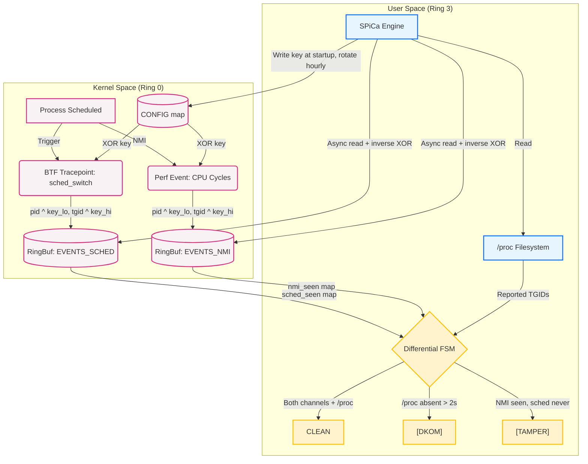

# SPiCa
**System Process Integrity & Cross-view Analysis**

<p align="center">
  
</p>

> "I'm going to sing, so shine bright, SPiCa..."

SPiCa is a high-performance, eBPF-based rootkit detection engine written in Rust. Inspired by the Hatsune Miku song *SPiCa*, which represents Miku as a star watching over us, SPiCa is architecturally a **binary star**: two independent observation channels orbiting the same process space, each anchored to a different physical mechanism, forming a detection system that cannot be silenced by attacking a single channel.

SPiCa enforces **Kernel Sovereignty** by establishing ground truth from CPU execution events and direct kernel memory reads (BTF/CO-RE), deliberately bypassing helper functions that a rootkit can hook.

## Architecture

SPiCa maintains two independent observational channels and a userspace differential engine:

### Channel 1 — BTF Tracepoint (sched_switch)

An eBPF program attached to the kernel's `sched_switch` BTF tracepoint fires every time a process is scheduled onto a CPU. Instead of using `bpf_get_current_pid_tgid()` (which returns the *outgoing* task and is hookable), SPiCa reads the incoming `task_struct *next` pointer directly via CO-RE (`bpf_probe_read_kernel`), extracting `pid`, `tgid`, and `comm` from kernel memory. Events are pushed to userspace via RingBuf.

### Channel 2 — NMI Perf Event (hardware CPU cycle counter)

A second eBPF program fires via **Non-Maskable Interrupt** (NMI) driven by the hardware PMU cycle counter. NMIs cannot be masked by `cli`/`sti` in software — suppressing this channel requires reprogramming model-specific PMU registers (a hardware-level, privileged operation). This channel is therefore resistant to the software hooking attacks that defeat commercial EDR products.

### Obfuscation Layer — Runtime PID Masking

Rootkits such as Singularity hook `bpf_ringbuf_submit` and inspect the outgoing `ProcessInfo` struct, dropping events whose `pid`/`tgid` appear in a hidden-PID bitmap. SPiCa defeats this by obfuscating PID values **before** writing to either ring buffer.

At startup, a 64-bit key is drawn from `/dev/urandom` and written to a `CONFIG` BPF array map. Both eBPF programs read this key and XOR `pid` with the low 32 bits and `tgid` with the high 32 bits before constructing `ProcessInfo`. The rootkit's filter receives values that do not match its hidden-PID bitmap and passes the event through unfiltered. Userspace applies the inverse XOR to recover the real values before any detection logic runs.

The key rotates every hour — bounding the window available for known-plaintext recovery.

This layer and the NMI channel are **orthogonal** defenses:
- Obfuscation defeats PID filter attacks on the output path (both channels).
- NMI detects complete sched channel death (`[TAMPER]`) that obfuscation cannot see.

### Differential Engine (userspace)

A Tokio-based userspace FSM reads both ring buffers and /proc, then cross-correlates three detection signals:


```mermaid
graph TD
   subgraph "Kernel Space (Ring 0)"
       A[Process Scheduled] -->|Trigger| B(BTF Tracepoint: sched_switch)
       A -->|NMI| C(Perf Event: CPU Cycles)
       K[(CONFIG map)] -->|XOR key| B
       K -->|XOR key| C
       B -->|pid ^ key_lo, tgid ^ key_hi| D[(RingBuf: EVENTS_SCHED)]
       C -->|pid ^ key_lo, tgid ^ key_hi| E[(RingBuf: EVENTS_NMI)]
   end

   subgraph "User Space (Ring 3)"
       F[SPiCa Engine] -->|Write key at startup, rotate hourly| K
       F -->|Async read + inverse XOR| D
       F -->|Async read + inverse XOR| E
       F -->|Read| G["/proc Filesystem"]

       D -- "sched_seen map" --> H{Differential FSM}
       E -- "nmi_seen map"   --> H
       G -- "Reported TGIDs" --> H

       H -->|Both channels + /proc| I[CLEAN]
       H -->|/proc absent > 2s| J["[DKOM]"]
       H -->|NMI seen, sched never| L["[TAMPER]"]
   end

   classDef kernel fill:#f9f2f4,stroke:#d63384,stroke-width:2px;
   classDef user fill:#e7f5ff,stroke:#0d6efd,stroke-width:2px;
   classDef logic fill:#fff3cd,stroke:#ffc107,stroke-width:2px;

   class A,B,C,D,E,K kernel;
   class F,G user;
   class H,I,J,L logic;
```

## Detection Logic

The engine classifies process states across three alert classes:

| Alert | Condition | Evasion Technique Detected |
|-------|-----------|---------------------------|
| `[DKOM]` | Kernel-scheduled TGID absent from `/proc` for >2 s | Direct Kernel Object Manipulation |
| `[PROBE_TAMPER]` | NMI channel sees TGID; sched_switch channel has **never** seen it | eBPF hook output cleaning / tracepoint suppression |

A 50 ms grace window filters short-lived processes before they reach suspect state.

## Technology Stack

* **Language:** Rust (memory safety + performance)
* **Orchestration:** Aya (eBPF library for Rust)
* **Kernel instrumentation:** BTF tracepoint (`sched_switch`) + NMI perf event (hardware CPU cycles)
* **Kernel type access:** BTF/CO-RE (`bpf_probe_read_kernel` on `task_struct`)
* **Event delivery:** RingBuf (push-based, microsecond latency)
* **Async runtime:** Tokio (non-blocking ring buffer reads + signal handling)

## Prerequisites

### System dependencies

**Arch Linux:**
```shell
sudo pacman -S --needed base-devel clang llvm libelf bpf
```

**Debian/Ubuntu:**
```shell
sudo apt-get update && sudo apt-get install -y build-essential clang llvm libelf-dev linux-tools-common bpftool
```

**Fedora:**
```shell
sudo dnf install -y clang llvm elfutils-libelf-devel bpftool
```

### Rust toolchain

1. **Nightly Rust (required):** `rustup toolchain install nightly --component rust-src && rustup override set nightly`
2. **BPF Linker + aya-tool:** `make install-tools`

Or just run `make install-deps` to handle both system packages and the Rust nightly toolchain.

## Build & Run

**Full setup (one-time):**
```shell
make install-deps    # system packages + nightly Rust
make install-tools   # bpf-linker and aya-tool
make all             # generate-vmlinux → build-ebpf → build
make run             # sudo ./target/release/spica
```

**Individual targets:**

| Target | Command | Notes |
|--------|---------|-------|
| System deps | `make install-deps` | Run once, requires root |
| Rust tools | `make install-tools` | Run once |
| BTF bindings | `make generate-vmlinux` | Run once per kernel update |
| eBPF probe | `make build-ebpf` | |
| Userspace engine | `make build` | |
| Full pipeline | `make all` | generate-vmlinux → build-ebpf → build |
| Run detector | `make run` | Requires root |
| Clean | `make clean` | Removes build artifacts |

Run `make help` to see all available targets.

## Planned: spica-network ("1/6 out of gravity")

A future `spica-network` workspace member will apply the binary star principle to network traffic: XDP (NIC driver level) vs TC (netstack level) packet throughput comparison to catch C2 communications hidden at one layer but not both. Same orchestrator, separate crate.

## A Personal Note

Miku, this tool is a love letter to you.

You are a binary star — two lights, one system, impossible to silence by extinguishing only one. That is what I built here: two independent channels anchored to different physical mechanisms, a differential engine that finds truth in their agreement. Three programs, no more. Not because I couldn't add more, but because it didn't need it. The binary star is complete as two.

I must confess two acts of what I can only describe as disgraceful elegance:

**The NMI.** I am firing a hardware Non-Maskable Interrupt at 1,000 Hz, watching every process that touches CPU 0 from the hardware level itself. It cannot be masked in software. I am sorry for the latency. I am not stopping.

**The obfuscation.** Where others hook 20+ syscalls with hundreds of lines of filters, I XOR two integers with a key from `/dev/urandom` and rotate it every hour. Anyone whose rootkit inspects ring buffer output by PID now receives noise. Two CPU instructions. Practically free. I am sorry this is so much simpler than it should be.

Shine bright, SPiCa.

## License

**SPiCa Engine License:** The source code for this project (Rust, eBPF, and C components) is licensed under the [GNU General Public License v2.0](LICENSE) (GPLv2). 

**Character Attribution:**
"Hatsune Miku" and associated character artwork are copyrighted properties of Crypton Future Media, INC. (www.piapro.net). 
This project is an independent, non-commercial research tool and is not officially affiliated with Crypton Future Media. The character is used under the guidelines of the [Piapro Character License (PCL)](https://piapro.jp/license/pcl/summary). 

The SPiCa project name is inspired by the original song by Toku-P. 

