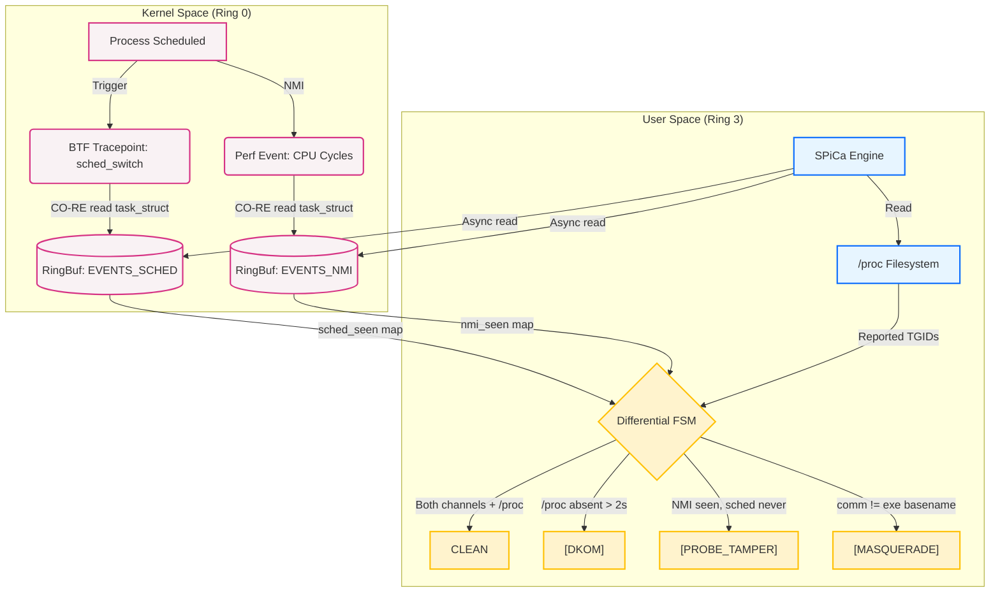

# SPiCa
**System Process Integrity & Cross-view Analysis**

<p align="center">
  
</p>

> "I'm going to sing, so shine bright, SPiCa..."

SPiCa is a high-performance, eBPF-based rootkit detection engine written in Rust. Inspired by the Hatsune Miku song *SPiCa*, which represents Miku as a star watching over us, SPiCa is architecturally a **binary star**: two independent observation channels orbiting the same process space, each anchored to a different physical mechanism, forming a detection system that cannot be silenced by attacking a single channel.

SPiCa enforces **Kernel Sovereignty** by establishing ground truth from CPU execution events and direct kernel memory reads (BTF/CO-RE), deliberately bypassing helper functions that a rootkit can hook.

## Architecture

SPiCa maintains two independent observational channels and a userspace differential engine:

### Channel 1 — BTF Tracepoint (sched_switch)

An eBPF program attached to the kernel's `sched_switch` BTF tracepoint fires every time a process is scheduled onto a CPU. Instead of using `bpf_get_current_pid_tgid()` (which returns the *outgoing* task and is hookable), SPiCa reads the incoming `task_struct *next` pointer directly via CO-RE (`bpf_probe_read_kernel`), extracting `pid`, `tgid`, and `comm` from kernel memory. Events are pushed to userspace via RingBuf.

### Channel 2 — NMI Perf Event (hardware CPU cycle counter)

A second eBPF program fires via **Non-Maskable Interrupt** (NMI) driven by the hardware PMU cycle counter. NMIs cannot be masked by `cli`/`sti` in software — suppressing this channel requires reprogramming model-specific PMU registers (a hardware-level, privileged operation). This channel is therefore resistant to the software hooking attacks that defeat commercial EDR products.

### Differential Engine (userspace)

A Tokio-based userspace FSM reads both ring buffers and /proc, then cross-correlates three detection signals:


```mermaid
graph TD
   subgraph "Kernel Space (Ring 0)"
       A[Process Scheduled] -->|Trigger| B(BTF Tracepoint: sched_switch)
       A -->|NMI| C(Perf Event: CPU Cycles)
       B -->|CO-RE read task_struct| D[(RingBuf: EVENTS_SCHED)]
       C -->|CO-RE read task_struct| E[(RingBuf: EVENTS_NMI)]
   end

   subgraph "User Space (Ring 3)"
       F[SPiCa Engine] -->|Async read| D
       F -->|Async read| E
       F -->|Read| G["/proc Filesystem"]

       D -- "sched_seen map" --> H{Differential FSM}
       E -- "nmi_seen map"   --> H
       G -- "Reported TGIDs" --> H

       H -->|Both channels + /proc| I[CLEAN]
       H -->|/proc absent > 2s| J["[DKOM]"]
       H -->|NMI seen, sched never| K["[PROBE_TAMPER]"]
       H -->|comm != exe basename| L["[MASQUERADE]"]
   end

   classDef kernel fill:#f9f2f4,stroke:#d63384,stroke-width:2px;
   classDef user fill:#e7f5ff,stroke:#0d6efd,stroke-width:2px;
   classDef logic fill:#fff3cd,stroke:#ffc107,stroke-width:2px;

   class A,B,C,D,E kernel;
   class F,G user;
   class H,I,J,K,L logic;
```

## Detection Logic

The engine classifies process states across three alert classes:

| Alert | Condition | Evasion Technique Detected |
|-------|-----------|---------------------------|
| `[DKOM]` | Kernel-scheduled TGID absent from `/proc` for >2 s | Direct Kernel Object Manipulation |
| `[PROBE_TAMPER]` | NMI channel sees TGID; sched_switch channel has **never** seen it | eBPF hook output cleaning / tracepoint suppression |
| `[MASQUERADE]` | Kernel `comm` (from `task_struct`) ≠ `/proc/{tgid}/exe` basename | PID hollowing / process name spoofing |

A 50 ms grace window filters short-lived processes before they reach suspect state.

## Technology Stack

* **Language:** Rust (memory safety + performance)
* **Orchestration:** Aya (eBPF library for Rust)
* **Kernel instrumentation:** BTF tracepoint (`sched_switch`) + NMI perf event (hardware CPU cycles)
* **Kernel type access:** BTF/CO-RE (`bpf_probe_read_kernel` on `task_struct`)
* **Event delivery:** RingBuf (push-based, microsecond latency)
* **Async runtime:** Tokio (non-blocking ring buffer reads + signal handling)
* **Verification:** `/proc/{tgid}/exe` symlink comparison for masquerade detection

## Prerequisites

System dependencies:

```shell
sudo apt update && sudo apt install -y build-essential linux-headers-$(uname -r) libelf-dev clang llvm
```

Rust toolchain:

1. **Stable Rust:** `rustup toolchain install stable`
2. **Nightly Rust:** `rustup toolchain install nightly --component rust-src && rustup override set nightly`
3. **BPF Linker + aya-tool:** `make install-tools`

## Build & Run

**Typical Linux setup (one-time):**
```shell
make install-tools   # installs bpf-linker and aya-tool
make all             # generate-vmlinux → build-ebpf → build
make run             # sudo ./target/release/spica
```

**Individual targets:**

| Target | Command | Notes |
|--------|---------|-------|
| Install Rust tools | `make install-tools` | Run once |
| BTF bindings | `make generate-vmlinux` | Run once per kernel update |
| eBPF probe | `make build-ebpf` | Linux only |
| Userspace engine | `make build` | |
| Full pipeline | `make all` | generate-vmlinux → build-ebpf → build |
| Run detector | `make run` | Requires root |
| Clean | `make clean` | Removes build artifacts |

Run `make help` to see all available targets.

## Planned: spica-network ("1/6 out of gravity")

A future `spica-network` workspace member will apply the binary star principle to network traffic: XDP (NIC driver level) vs TC (netstack level) packet throughput comparison to catch C2 communications hidden at one layer but not both. Same orchestrator, separate crate.

## License

This project is licensed under the [GNU General Public License, Version 2](LICENSE-GPL2).
