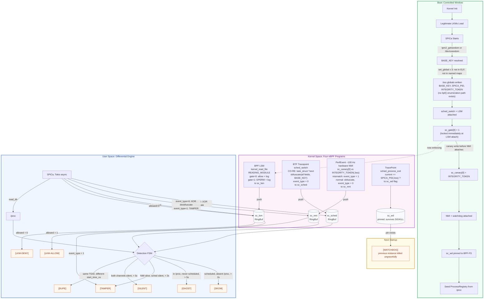
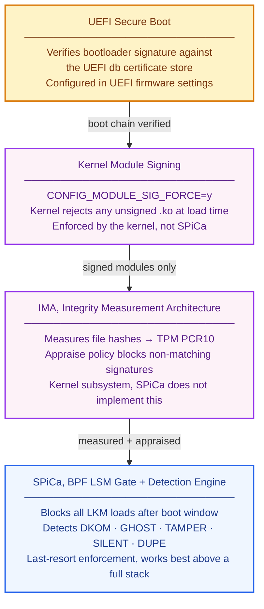

# SPiCa
**System Process Integrity & Cross-view Analysis**

<p align="center">
  
</p>

> "I'm going to sing, so shine bright, SPiCa..."

SPiCa is an eBPF-based rootkit detector written in Rust. Its name comes from two places at once: the Hatsune Miku song *SPiCa*, and the real star, Spica (Alpha Virginis), the brightest point in Virgo. What looks like a single star to the naked eye is actually a spectroscopic binary: two massive stars locked in a mutual orbit, indistinguishable as separate objects without measuring their spectra.

> **Disclaimer:** Significant portions of this codebase were generated or refactored with Claude Code assistance. While rigorous testing and iterative design were applied, review the code for security and performance before production use.

---

## The Old Battle: Kernel Cat and Mouse

For two decades, endpoint security has been a residency war. A rootkit loads a kernel module. A detector writes code to find it. The rootkit hooks the detector's tracepoints. The detector adds a second channel. The rootkit suppresses both channels simultaneously. The detector adds liveness monitoring. The rootkit patches the liveness monitor's data structures. And so on, forever.

The original SPiCa design was a direct participant in this war. It ran two independent observation channels, a BTF tracepoint on `sched_switch` and a hardware NMI perf event, and cross-correlated them. A rootkit that suppressed one channel would be exposed by the other. A rootkit that suppressed both simultaneously would have to fight across two physically distinct mechanisms: software hooks for the tracepoint and PMU register reprogramming for NMI. The NMI channel was specifically chosen because Non-Maskable Interrupts cannot be disabled with `cli`, the only way to suppress them is to reprogram the hardware PMU, a desperate and destabilizing operation.

This was a principled design. It was also expensive, NMI interrupts firing at 1000 Hz across every logical CPU, and it was still, at its core, a fair fight. Both SPiCa and the rootkit were playing in Ring 0. SPiCa observed from kernel context; the rootkit modified kernel context. Every countermeasure SPiCa added could be identified and targeted. The war had no end state.

The correct answer is not to fight harder. It is to change the battlefield.

---

## The New Horizon: Establishing Sovereignty Before the Fight Begins

The right question is not "how do we detect rootkits that are already in the kernel?" It is "how do we make it impossible for rootkits to enter the kernel in the first place, and then observe from a position they cannot reach?"

This is what cloud providers figured out long before kernel security researchers caught up.

Amazon's Nitro system did not try to harden the hypervisor against guest attacks. It removed the hypervisor from the guest's attack surface entirely, offloading all I/O to dedicated hardware chips that the guest OS cannot address. Google's Titan chip does not try to protect cryptographic keys inside the OS. It puts them in silicon the OS cannot see. Apple's Secure Enclave does not try to hide key material from the kernel. It physically isolates it on a separate processor with no DMA path to the main CPU.

The pattern is always the same: **the security boundary must be placed below the level at which the adversary operates.** You cannot win a residency war when the adversary has the same privileges as your security controls. You win by making the adversary's privilege insufficient to reach your controls at all.

SPiCa v3 applies this insight at the kernel level.

The primary attack vector for kernel-level rootkits on a modern Linux system is the Loadable Kernel Module interface. An attacker with sufficient privileges calls `insmod` and their code runs in Ring 0, the same privilege level as the kernel itself, and the same level as any eBPF-based detector. Once kernel code is loaded, the attacker can hook tracepoints, modify ring buffer consumer pointers, patch kernel data structures, and in principle do anything the kernel can do. This is the fair fight. SPiCa refuses it.

Instead, SPiCa uses a **BPF LSM hook on `kernel_read_file`** to block all `READING_MODULE` operations after an initialization window. Boot-time modules, the drivers the system actually needs, are loaded before SPiCa starts. Once the system is up and SPiCa has seeded its process registry, it closes the gate. Any subsequent `insmod` or `modprobe` call returns `EPERM`. The hook lives in eBPF, attached by SPiCa, and detaches automatically if SPiCa exits.

The consequence is significant: after the gate closes, **the only kernel code that can run is the kernel code that was already there**. A rootkit that cannot load a module cannot hook tracepoints. Cannot modify ring buffer consumer pointers. Cannot patch `task_struct` fields. Cannot suppress eBPF output. The entire class of LKM-based kernel residency is foreclosed at the loading vector rather than hunted after entry.

This does not close every attack surface, a kernel exploit that bypasses syscall boundaries to achieve arbitrary kernel write access without `init_module` still exists in theory. But it changes the adversary's requirements from "elevated Linux privileges" to "unpublished or unpatched kernel exploit," which is a categorically different threat model. For any adversary not operating at nation-state exploit capability, LKM loading is the door. SPiCa locks it.

---

## Architecture

With LKM loading blocked, the dual-channel design of the previous version becomes a fallback defense. While the LSM gate is designed to be impenetrable, sophisticated adversaries might attempt to bypass it via early-boot persistence or manual memory mapping. SPiCa v3.1 restores the NMI channel to detect such "blinding" attacks. The NMI channel fires at a lower, optimized frequency (~100Hz) to provide a reliable hardware-based heartbeat with minimal overhead.

SPiCa v3.1 implements four detection classes:
* **DKOM (Direct Kernel Object Manipulation):** An eBPF-active process is absent from `/proc`.
* **GHOST:** A process is present in `/proc` but has never been observed by any eBPF channel.
* **TAMPER:** Hardware NMI shows a process is active but the `sched_switch` tracepoint is silent (tracepoint suppression); or the NMI integrity canary detects that a rootkit intercepted a BPF map write (map hook tampering).
* **SILENT:** A process in `/proc` was previously observed, but both eBPF channels have gone silent (indicates total monitoring loss).

### What Remains: The Sched Channel

An eBPF program attached to the `sched_switch` BTF tracepoint fires every time the kernel schedules a process onto a CPU. It reads the incoming `task_struct *next` pointer directly from the tracepoint argument via CO-RE (`bpf_probe_read_kernel`), extracting `pid`, `tgid`, `comm`, and the process birth timestamp from `group_leader->start_time`. Events are pushed to userspace via RingBuf.

The program deliberately avoids `bpf_get_current_pid_tgid()` and `bpf_get_current_comm()` in this context. At `sched_switch` time, "current" is the *outgoing* task, not the incoming one we are observing. These helpers return the wrong process, and they are themselves hookable. CO-RE reads of the `task_struct` pointer from the tracepoint argument bypass both problems.

### What Remains: The Threat is Now eBPF Rootkits

With LKMs blocked, the threat model compresses to a narrower and weaker adversary: the eBPF rootkit. An eBPF program with elevated privileges can read kernel memory via `bpf_probe_read_kernel`, enumerate named BPF maps via the `bpf()` syscall, and perform bounded computation. What it cannot do is arbitrary kernel code execution, every instruction it executes passes the eBPF verifier, which enforces memory safety, bounded loops, and stack limits. An eBPF rootkit cannot hook kernel functions, cannot modify `task_struct` fields, cannot intercept ring buffer writes below the eBPF layer.

This is a fundamentally weaker adversary than the LKM rootkit. And SPiCa's remaining anti-evasion machinery is designed specifically for this constrained threat.

### Rice's Theorem as Integrity Protection

The obfuscation layer in the original SPiCa XOR'd PID and TGID values in the ring buffer to prevent a hypothetical rootkit from reading the ring buffer and seeing which processes SPiCa was tracking. The key was generated at compile time from `/dev/urandom` and baked into the eBPF bytecode as a constant. This was the correct approach for the old threat model. Against an eBPF rootkit in the new model, it can be improved.

The compile-time constant, while not in a named BPF map, lives in the eBPF ELF bytecode. An adversary with access to the loaded program's bytecode via `bpf_prog_get_info_by_fd` can disassemble it and recover the constant. The key exists as an enumerable artifact.

SPiCa v3 moves `BASE_KEY` out of the eBPF bytecode entirely and into the program's `.bss` section, a zero-initialized static global that userspace writes before the program is loaded into the kernel, via aya's `set_global()` API. The `.bss` section of an eBPF program is backed by a per-program anonymous array map with `BPF_F_RDONLY_PROG`. This map is **not accessible to other eBPF programs** via `bpf_map_lookup_elem`. It is not enumerable via the `bpf()` syscall's map iteration interface. It does not appear in `/proc/kallsyms`.

To find the key, an eBPF rootkit must scan kernel virtual memory using `bpf_probe_read_kernel` from an address it must first discover. The load address of SPiCa's `.bss` section is not published anywhere accessible to eBPF. This is where Rice's theorem becomes relevant.

Rice's theorem states that no general algorithm can decide any non-trivial semantic property of an arbitrary program. An eBPF rootkit attempting to find the key's memory address is, in the Turing sense, attempting to decide a semantic property of SPiCa's execution, specifically, which address will hold the key value at runtime. The eBPF verifier's loop bounds prevent systematic full-memory scanning. The rootkit cannot enumerate the address. It cannot statically analyze SPiCa's bytecode to find it, because the key is not in the bytecode. The `.bss` base address is not symbolic. From within the eBPF execution model, the key's location is undecidable.

This is not cryptographic security, an LKM could read kernel memory freely and find the key with trivial effort. But LKMs are blocked. Against the constrained eBPF rootkit that is our remaining adversary, undecidability of address location is a practical integrity guarantee.

### TPM Key, Hardware Below the Software Stack

The compile-time key has one remaining weakness: it exists in the build artifacts on disk. An attacker with filesystem access to the compiled binary can recover the key by running `strings` against the userspace binary (which includes the key for deobfuscation) or by analyzing the build environment.

SPiCa v3 addresses this with a TPM-seeded key. At startup, userspace calls `tpm2_getrandom 8` to request 8 bytes of hardware-attested randomness from the TPM. This key is then written directly into the eBPF program's `.bss` global before the program is loaded into the kernel. The ELF binary contains no key. The build artifacts contain no key. The key exists only in TPM hardware and in kernel memory for the duration of the SPiCa process.

A key sourced from a TPM is, in practice, beyond the reach of any software attack. Recovering it requires physical access to the TPM chip, knowledge of the PCR state at the time of unsealing, or exploitation of the TPM's firmware, all of which are categorically harder than reading a constant from an ELF.

On systems without a TPM, VMs, containers, machines without a TPM chip, SPiCa falls back transparently to the compile-time key with a log warning. The security model degrades gracefully to the previous version's guarantees.

This is the same insight cloud providers applied with their hardware root-of-trust chips. The key material lives below the software stack. No software attack can reach it. The security boundary is placed at a level the adversary cannot access.

### Watchdog: Forensic Evidence of a Kill

SIGKILL and SIGSTOP cannot be caught by a process. If an adversary kills SPiCa with `kill -9`, the process receives no signal, the kernel terminates it directly. A traditional signal handler cannot emit a "I was killed" alert because the handler never runs.

SPiCa's watchdog is a third eBPF program, attached to the `sched_process_exit` tracepoint. When any process exits, the watchdog fires. It reads the exiting TGID via `bpf_get_current_pid_tgid()`, safe at `sched_process_exit` because "current" is genuinely the dying process, not a scheduling artifact, and compares it against SPiCa's own TGID, held in the `.bss` global `SPICA_PID` (written via `set_global()` before programs are loaded, never in a named map).

On a match, the watchdog sets a flag in `sc_wd`, a named BPF map pinned to `/sys/fs/bpf/spica_watchdog` before the main loop begins. BPF filesystem pins outlive the process that created them. Even after SPiCa is killed and all its file descriptors are closed, the pinned map remains on the filesystem.

On the next SPiCa startup, the first thing it does is check whether the pin exists. If it does, the previous run did not exit cleanly. SPiCa prints `[WATCHDOG] Previous instance not cleanly terminated, possible SIGKILL or crash` and clears the pin before proceeding. The `sched_process_exit` tracepoint fires during the kernel's process teardown, which happens before file descriptors are closed, so the watchdog flag is set while the pinned map is still reachable, and the forensic evidence persists across the SIGKILL boundary.

On a clean exit (SIGTERM or SIGINT), SPiCa removes the pin file before returning. The next startup sees no pin and starts quietly.

---

## What Cloud Providers Discovered

The security industry spent the 1990s and 2000s treating intrusion detection as a detection problem. Build better signatures. Write better heuristics. Detect malware faster. The adversary always had the same access level as the detector, Ring 0 for kernel security, Ring 3 for userspace security, and the war produced an endless succession of more sophisticated detectors and more sophisticated evasions.

Cloud providers discovered, through billions of dollars of incidents, that this arms race has no winner. Their answer was not a better detector. It was a different architecture.

AWS Nitro removed the hypervisor from the guest's trust boundary entirely. Google Titan established hardware roots of trust below the software stack. Every major cloud provider moved their critical security controls to a privilege level below the adversary's reach, hardware, firmware, or a physically separate processor. The guest OS cannot attack the hypervisor because the hypervisor does not exist in the guest's address space.

SPiCa v3 is a small-scale rediscovery of this principle, applied at the Linux kernel level:

- **LKM blocking** moves the security control to a point the adversary must pass through before they can do anything. The LSM hook fires before `init_module` executes. The adversary cannot bypass it without bypassing the LSM framework itself, which requires kernel code execution, which requires an LKM, which is blocked. The circularity is intentional.

- **The TPM key** places cryptographic material below the software stack. No software attack can read a TPM output that was never written to disk. The key exists only in hardware and in the kernel's volatile memory for the lifetime of the process.

- **The `.bss` placement and Rice's theorem** exploit the fundamental constraint that the eBPF verifier places on the remaining adversary. The eBPF rootkit is not Ring 0 in the traditional sense, it is Ring 0 constrained by the verifier, which means it has strictly less capability than an LKM. Against this constrained adversary, undecidability of address location is a meaningful defense.

The original SPiCa was a detector. SPiCa v3 is a gatekeeper that also detects. The NMI channel's overhead and the TAMPER/SILENT logic's complexity were the cost of fighting a war at the adversary's level. That war is now over because the adversary cannot enter.

---

## Detection Logic


```mermaid
graph TD
    subgraph BOOT["Boot: Controlled Window"]
        direction TB
        K[Kernel Init] --> MODS[Legitimate LKMs Load]
        MODS --> S0[SPiCa Starts]
        S0 -->|tpm2_getrandom or /dev/urandom| KEY[BASE_KEY resolved]
        KEY -->|set_global x 3: not in ELF, not in named maps| BSS[".bss globals written\nBASE_KEY, SPICA_PID, INTEGRITY_TOKEN\n(no bpf() enumeration path exists)"]
        BSS --> S1["sched_switch + LSM attached"]
        S1 --> GATE["sc_gate[0] = 1\n(locked immediately at LSM attach)"]
        GATE -->|canary write before NMI attaches| CANARY["sc_canary[0] = INTEGRITY_TOKEN"]
        CANARY --> NMI_A[NMI + watchdog attached]
        NMI_A --> PIN[sc_wd pinned to BPF-FS]
        PIN --> S3[Seed ProcessRegistry from /proc]
    end

    subgraph RING0["Kernel Space: Four eBPF Programs"]
        direction TB
        GATE -.->|now enforcing| LSM_P["BPF LSM\nkernel_read_file\nREADING_MODULE\ngate=0: allow + log\ngate=1: EPERM + log\nto sc_lsm"]

        SCHED_P["BTF Tracepoint\nsched_switch\nCO-RE: task_struct *next\nobfuscate(all fields, BASE_KEY)\nevent_type = 0\nto sc_sched"]

        NMI_P["PerfEvent ~100 Hz hardware NMI\nsc_canary[0] vs INTEGRITY_TOKEN(.bss)\nmismatch: event_type = 1\nnormal: obfuscate, event_type = 0\nto sc_nmi"]

        WATCH_P["TracePoint\nsched_process_exit\ncurrent == SPICA_PID(.bss) ?\nto sc_wd flag"]

        SCHED_P -->|push| RB_S[(sc_sched\nRingBuf)]
        NMI_P -->|push| RB_N[(sc_nmi\nRingBuf)]
        LSM_P -->|push| RB_L[(sc_lsm\nRingBuf)]
        WATCH_P --> WD[(sc_wd\npinned: survives SIGKILL)]
    end

    subgraph RING3["User Space: Differential Engine"]
        direction TB
        ENGINE[SPiCa, Tokio async] -->|event_type=0: XOR deobfuscate| RB_S
        ENGINE -->|event_type=0: XOR deobfuscate\nevent_type=1: TAMPER| RB_N
        ENGINE -->|allowed=1| RB_L
        ENGINE -->|allowed=0| RB_L
        ENGINE -->|read_dir| PROC["/proc"]

        RB_S --> FSM{Detection FSM}
        RB_N --> FSM
        PROC --> FSM

        FSM -->|scheduled, absent /proc, > 2s| D1["[DKOM]"]
        FSM -->|in /proc, never scheduled, > 5s| D2["[GHOST]"]
        FSM -->|NMI alive, sched silent, > 2s| D3["[TAMPER]"]
        FSM -->|both channels silent, > 5s| D4["[SILENT]"]
        FSM -->|same TGID, different start_time_ns| D5["[DUPE]"]
        RB_N -->|event_type = 1| D3
        RB_L -->|allowed = 1| D7["[LKM-ALLOW]"]
        RB_L -->|allowed = 0| D8["[LKM-DENY]"]
    end

    subgraph NEXT["Next Startup"]
        WD -->|pin exists| D6["[WATCHDOG]\nprevious instance killed ungracefully"]
    end

    classDef bootbox  fill:#f0fdf4,stroke:#16a34a,stroke-width:2px,color:#14532d;
    classDef kernbox  fill:#fdf2f8,stroke:#9333ea,stroke-width:2px,color:#581c87;
    classDef userbox  fill:#eff6ff,stroke:#2563eb,stroke-width:2px,color:#1e3a8a;
    classDef nextbox  fill:#fefce8,stroke:#ca8a04,stroke-width:2px,color:#713f12;
    classDef alertbox fill:#fff7ed,stroke:#ea580c,stroke-width:1px,color:#7c2d12;
    classDef storage  fill:#f8fafc,stroke:#64748b,stroke-width:1px;

    class BOOT bootbox;
    class RING0 kernbox;
    class RING3 userbox;
    class NEXT nextbox;
    class D1,D2,D3,D4,D5,D6,D7,D8 alertbox;
    class RB_S,RB_N,RB_L,WD storage;
```

| Alert | Condition | What it detects |
|-------|-----------|-----------------|
| `[DKOM]` | Kernel-scheduled TGID absent from `/proc` for >2 s | Direct Kernel Object Manipulation, process hidden from userspace enumeration |
| `[GHOST]` | TGID present in `/proc` but never seen by any eBPF channel for >5 s | `/proc` spoofing, fake entry inserted to pass DKOM checks |
| `[TAMPER]` | NMI alive but sched_switch silent for >2 s; or NMI emits `event_type=1` integrity sentinel | Tracepoint suppression, or rootkit intercepted a `bpf_map_update_elem` call for the integrity canary |
| `[SILENT]` | Both channels dark on a previously-observed TGID for >5 s | Total eBPF observation loss |
| `[DUPE]` | Same TGID, different `start_time_ns` across events | `task_struct` field spoofing, rootkit patches `tgid` to impersonate a legitimate process |
| `[WATCHDOG]` | `/sys/fs/bpf/spica_watchdog` pin exists at startup | Previous instance was killed ungracefully (SIGKILL, OOM, crash) |
| `[LKM-ALLOW]` | `READING_MODULE` call intercepted while gate is open (boot window) | Audit record: module loaded before gate locked, not IMA, just a visibility log |
| `[LKM-DENY]` | `READING_MODULE` call intercepted while gate is locked | `insmod`/`modprobe` blocked post-init; names the calling process |

A 50 ms grace window prevents GHOST alerts on freshly-forked processes. All per-TGID alerts have a 30 s cooldown to prevent log flooding.

---

## Anti-Evasion Design

### LKM Gate, Eliminating the Loading Vector

The LSM `kernel_read_file` hook intercepts all `READING_MODULE` operations and returns `-EPERM` once `sc_gate[0]` is set. This flag is set after SPiCa seeds its registry from `/proc`. Any `insmod` or `modprobe` call after this point fails regardless of the caller's capabilities. The hook detaches automatically when SPiCa exits, restoring normal module loading, SPiCa does not permanently modify kernel behavior, which would make it indistinguishable from the rootkits it detects.

The gate requires `CONFIG_BPF_LSM=y` and `lsm=bpf` (or `lsm=...,bpf`) in the kernel command line. If BPF LSM is unavailable, SPiCa logs a warning and continues without the gate, detection logic still functions, but the LKM loading vector is not blocked.

### XDP Network Blocking, Dropping Incoming Packets Until Initialization

During early boot and SPiCa's initialization window, a dedicated eBPF **XDP (eXpress Data Path)** program `spica_xdp` is attached to all non-loopback network adapters.
* **The Goal:** Block remote C2 signalling and inbound payloads before SPiCa is fully up and the LKM gate is locked.
* **The Logic:** The XDP hook processes incoming packets at the driver/NIC queue level (ingress). While `sc_net_gate[0] == 0` (initialization not yet complete), it returns `XDP_DROP` to silence the network interface.
* **Release:** Once the process registry is seeded and the kernel LKM gate is fully locked, userspace updates `sc_net_gate[0] = 1`. The XDP program instantly transitions to `XDP_PASS`, resuming standard host networking with zero boot-time exposure.

### LKM Audit Log, Visibility Into What Ran and What Didn't

The LSM gate blocks modules, but a pure blocker is opaque: it gives no record of what modules loaded during the boot window before the gate closed, and no alert when a blocked attempt occurs. SPiCa adds a per-event audit log via a dedicated `sc_lsm` ring buffer.

Every `READING_MODULE` intercept, regardless of whether it is allowed or denied, emits an `LkmEvent` containing the caller's `pid`, `tgid`, `comm`, and a kernel timestamp. Userspace prints one of two alert classes:

- **`[LKM-ALLOW]`**: module load during the boot window (`gate=0`). These are the legitimate drivers the system needed. The log gives a complete snapshot of kernel module surface area at the time SPiCa locked the gate.
- **`[LKM-DENY]`**: module load attempt after the gate closed (`gate=1`). The call returns `EPERM`; the alert names the process that tried. A rogue `insmod` is no longer silent, it appears in the log immediately.

**This is not IMA.** IMA (Integrity Measurement Architecture) is a separate Linux kernel subsystem that measures and verifies file hashes/signatures before execution, extending measurements into TPM PCRs. SPiCa cannot implement IMA from eBPF, it is part of the kernel itself. What SPiCa provides here is a visibility and enforcement layer: who tried to load what, and whether it was permitted. For signature-based pre-approval of specific modules, you need IMA configured at the kernel level, see *Defense in Depth* below.

The events are not XOR-obfuscated. The `comm` field (`insmod`, `modprobe`, or a custom loader name) carries no secret, and the LSM hook runs before any BASE_KEY context is available. Userspace reads the raw struct directly from the ring buffer.

### Full Structure XOR Obfuscation, Blinding the Filters

Rootkits like Singularity do not just suppress events; they **filter** them. By hooking `bpf_ringbuf_submit`, they can inspect the data being sent to userspace. If they see a known malicious PID or a timestamp that looks like a security event (e.g., `last_seen > 10^9`), they drop the event while letting legitimate traffic through.

SPiCa v3.1 implements **Full Structure XOR Obfuscation**. Instead of only encrypting PIDs, every field in the `ProcessInfo` structure, including the `last_seen` timestamp, the `comm` process name, and the `cpu_id`, is XORed with the TPM-backed key before entering the ring buffer.

To a filtering rootkit, the event data looks like random noise. Because the `last_seen` field no longer contains a valid timestamp, the rootkit's sanity checks fail, and the "security event" is passed through as unrecognized data. Userspace reverses the XOR to restore the structured data. This transforms the ring buffer from a transparent log into an opaque, encrypted tunnel.

The one field deliberately left unobfuscated is `event_type`. When the NMI integrity canary detects tampering, it emits an event with `event_type = 1` as an unambiguous sentinel for userspace. A rootkit that filters on `event_type == 1` still loses, the missing NMI heartbeat triggers `[TAMPER]` via the dual-channel divergence check independently.

### Key Storage, `.bss` and Rice's Theorem

Three values live in the eBPF program's `.bss` section, written by userspace via `set_global()` before any program is loaded into the kernel: `BASE_KEY` (the XOR obfuscation key), `SPICA_PID` (SPiCa's own TGID, used by the watchdog to avoid a separately-enumerable named map), and `INTEGRITY_TOKEN` (the expected integrity canary value, the ground truth the NMI compares against).

Named BPF maps are enumerable via the `bpf()` syscall. `.bss` sections are not. An eBPF rootkit that wants to find any of these values must scan kernel memory from an address it cannot discover, `bpf_probe_read_kernel` requires a known source address, and the `.bss` load address is not in `/proc/kallsyms` or any other enumerable index. By Rice's theorem, no eBPF-constrained program can decide the semantic meaning of a memory address it has not been given. The address is not given.

### TPM Randomness & PCR Hardening, Trust below the OS

When a TPM is available, the key is sourced from `tpm2_getrandom` rather than the build system. It is never written to disk. It is never in the ELF binary. It is never in a named BPF map. Recovering it requires compromising the TPM hardware or performing a live memory forensics operation on the running kernel, both of which are categorically out of reach for a software rootkit. On systems without a TPM, the build-time key (also never in a named map) is used as a fallback.

Additionally, SPiCa **hardens the TPM trust path** by conducting an evolutionary boot-chain audit on startup. It runs `tpm2_pcrread sha256:0,2,4,7` to check:
* **PCR 0**: Core BIOS/Firmware measurements.
* **PCR 2**: Option ROM measurements.
* **PCR 4**: Bootloader, Shim, and secure kernel command-line arguments.
* **PCR 7**: UEFI Secure Boot state and DB/DBX certificate validation.

By reading and logging these cryptographically signed PCR states, SPiCa provides a tamper-evident, non-forgeable platform measurement log at boot time. Any attempt to disable Secure Boot or tamper with the early boot chain will result in modified PCR hashes, alerting userspace audit systems immediately.

### BPF Map Integrity, NMI Canary

The `.bss` protection eliminates most eBPF-level attack surfaces, but named maps are still required for things that cannot live in `.bss`: ring buffers, the watchdog pin, and the LSM gate. A sophisticated rootkit could hook `bpf_map_update_elem` and silently intercept writes to these maps.

SPiCa detects this class of attack with an NMI canary check. At startup, userspace derives `integrity_token = SipHash-1-3(BASE_KEY, "SPiCaINT")` and writes it to two places: the `.bss` global `INTEGRITY_TOKEN` (via `set_global()`, unreachable by any eBPF hook) and the named map `sc_canary` (via `bpf_map_update_elem`, the tamper target). The canary is written **before** the NMI program is attached, so there is no window where the NMI can fire before the canary is set.

On every NMI tick the NMI program reads `sc_canary[0]` and compares it to `INTEGRITY_TOKEN` from `.bss`. The NMI fires at hardware interrupt level with no process PID context, so rootkit hooks that filter on "current task is hidden" never match. If the values diverge, the rootkit dropped or modified the `bpf_map_update_elem` write, the NMI emits an `event_type = 1` sentinel to `sc_nmi`. Userspace fires `[TAMPER]` immediately.

The rootkit cannot forge the correct `sc_canary` value without knowing `INTEGRITY_TOKEN`. `INTEGRITY_TOKEN` is the SipHash output keyed by `BASE_KEY`; `sc_canary[0]` (an enumerable map, readable by root) reveals only the hash output, not the key. Inverting SipHash to recover `BASE_KEY` is computationally infeasible. Every possible interception either produces a detectable mismatch or requires finding `BASE_KEY`, which requires finding the `.bss` address, which requires solving an undecidable address location problem.

### CO-RE Reads, Bypass Hookable Helpers

`bpf_get_current_pid_tgid()` and `bpf_get_current_comm()` read the *current running task* at helper-call time. At `sched_switch`, that is the *outgoing* task, wrong process. These helpers are also hookable in the old LKM threat model. CO-RE reads of `task_struct` fields directly from the tracepoint argument pointer bypass both issues, reading the incoming `next` task with no helper indirection.

### Process Birth Timestamps, TGID Reuse Detection

Alongside each `pid` and `tgid`, SPiCa reads `group_leader->start_time`, the monotonic nanosecond birth timestamp of the TGID's main thread. This is the most stable process identifier: it cannot be forged without modifying two separate `task_struct` fields simultaneously. The first real observation of a TGID anchors its birth timestamp. Any subsequent event with the same TGID but a different timestamp means two structurally distinct processes are sharing an identity, which triggers `[DUPE]` immediately.

---

## Defense in Depth, The Full Security Stack

SPiCa is the **last enforcement layer**. It is designed to complement a properly configured system, not replace the layers above it. If you skip the layers below, SPiCa's gate is all that stands between an attacker with root and arbitrary kernel code execution.


```mermaid
flowchart TD
    SB["UEFI Secure Boot\n─────────────────────────────\nVerifies bootloader signature against\nthe UEFI db certificate store\nConfigured in UEFI firmware settings"]

    MS["Kernel Module Signing\n─────────────────────────────\nCONFIG_MODULE_SIG_FORCE=y\nKernel rejects any unsigned .ko at load time\nEnforced by the kernel, not SPiCa"]

    IMA["IMA, Integrity Measurement Architecture\n─────────────────────────────\nMeasures file hashes → TPM PCR10\nAppraise policy blocks non-matching signatures\nKernel subsystem, SPiCa does not implement this"]

    SPICA["SPiCa, BPF LSM Gate + Detection Engine\n─────────────────────────────\nBlocks all LKM loads after boot window\nDetects DKOM · GHOST · TAMPER · SILENT · DUPE\nLast-resort enforcement, works best above a full stack"]

    SB  -->|"boot chain verified"| MS
    MS  -->|"signed modules only"| IMA
    IMA -->|"measured + appraised"| SPICA

    classDef firmware fill:#fef3c7,stroke:#d97706,stroke-width:2px,color:#78350f
    classDef kernel   fill:#fdf2f8,stroke:#9333ea,stroke-width:2px,color:#581c87
    classDef spica    fill:#eff6ff,stroke:#2563eb,stroke-width:2px,color:#1e3a8a

    class SB firmware
    class MS,IMA kernel
    class SPICA spica
```

SPiCa checks all four layers at startup and prints their status:

```
[STACK]      Secure Boot ...............  OK
[STACK]      Module signing (SIG_FORCE)   MISSING
[STACK]      IMA active .................  OK
[STACK]      IMA module appraise policy   MISSING
[WARN]       One or more security stack layers are missing.
[WARN]       SPiCa's BPF gate is a last-resort control, not a substitute.
[WARN]       See README: Defense in Depth for setup instructions.
```

### Setting Up Each Layer

#### Secure Boot
Enable in your UEFI firmware settings. For custom kernels, enroll your signing key with `mokutil`:
```shell
mokutil --import my-key.der   # enroll key, prompts on next boot
```
Verify: `mokutil --sb-state` should print `SecureBoot enabled`.

#### Kernel Module Signing
Compile the kernel with:
```
CONFIG_MODULE_SIG=y
CONFIG_MODULE_SIG_FORCE=y
CONFIG_MODULE_SIG_ALL=y
CONFIG_MODULE_SIG_KEY="certs/signing_key.pem"
```
On distro kernels this is usually already set. Check:
```shell
grep MODULE_SIG /boot/config-$(uname -r)
```

#### IMA, Integrity Measurement Architecture
**Kernel requirements:**
```
CONFIG_IMA=y
CONFIG_IMA_APPRAISE=y
CONFIG_IMA_MEASURE_PCR_IDX=10
```
Add to kernel command line (`/etc/default/grub` → `GRUB_CMDLINE_LINUX`):
```
ima_policy=appraise_tcb ima_appraise=enforce
```
To specifically cover kernel modules, write a custom IMA policy:
```shell
echo "appraise func=MODULE_CHECK appraise_type=imasig" \
  > /sys/kernel/security/ima/policy
```
Sign modules with IMA xattrs:
```shell
evmctl ima_sign --key private_key.pem module.ko
```
Verify IMA is active: `ls /sys/kernel/security/ima/`, should exist.

#### What SPiCa Adds on Top
With all three layers above active, an attacker with root still cannot load a new LKM at runtime because:
1. It's not signed (module signing rejects it)
2. Its hash isn't in the IMA measurement log (IMA appraise rejects it)
3. Even if they bypassed both, SPiCa's BPF gate returns `EPERM` (LSM hook rejects it)

Without the layers above, SPiCa's gate alone is a strong runtime control, but it provides no guarantee about what ran *before* SPiCa started.

---

## Known Remaining Attack Surface

- **Kernel exploit (non-LKM arbitrary write):** An attacker with a kernel memory corruption exploit that does not go through `init_module` can write arbitrary kernel memory without triggering the LSM gate. This is a strictly harder operation than `insmod` and typically requires a local privilege escalation CVE. The gate raises the floor; it does not ceiling the adversary.
- **LSM bypass via BPF_LSM configuration:** If the kernel is not compiled with `CONFIG_BPF_LSM` or does not have `lsm=bpf` in the command line, `sc_gate` cannot be enforced. SPiCa logs a warning and runs in detection-only mode.
- **eBPF rootkit with .bss address leak:** If a future eBPF rootkit discovers SPiCa's `.bss` load address through a kernel information leak, both `BASE_KEY` and `INTEGRITY_TOKEN` become readable. The TPM key mitigates this: the runtime key is ephemeral and differs every boot, so any key recovered from a prior run is useless. The `.bss` address itself must still be rediscovered on each boot.
- **Canary write interception with correct forgery:** If a rootkit intercepts the `sc_canary` write and replaces the value with the correct `integrity_token`, the NMI check passes. This requires knowing `INTEGRITY_TOKEN` before it is written, which requires the `.bss` address, which brings us to the prior bullet. The TPM key and `.bss` protection are co-dependencies; defeating one without the other is insufficient.

---

## Technology Stack

| Component | Technology | Why |
|-----------|-----------|-----|
| Language | Rust | Memory safety without GC overhead |
| eBPF loader | Aya | Rust-native eBPF, no C runtime |
| Scheduler observation | BTF tracepoint (`sched_switch`) | CO-RE access to `task_struct *next`; no hookable helpers in critical path |
| Module blocking | BPF LSM (`kernel_read_file`) | Intercepts at the loading vector before any module code runs |
| Process exit detection | TracePoint (`sched_process_exit`) | Fires in kernel context before fds are closed; outlives SIGKILL |
| Key randomness | TPM (`tpm2_getrandom`) with compile-time fallback | Key material below the software stack |
| Key + PID + canary storage | eBPF `.bss` globals via `set_global()` | `BASE_KEY`, `SPICA_PID`, `INTEGRITY_TOKEN`, not in bytecode, not in named map, not enumerable via `bpf()` |
| Integrity canary | NMI perf event reads `sc_canary` vs `.bss` `INTEGRITY_TOKEN` | Detects `bpf_map_update_elem` interception; NMI has no process context so rootkit PID filters never match |
| Event delivery | RingBuf | Push-based, microsecond latency, wakes userspace only when data exists |
| Async runtime | Tokio | Non-blocking ring buffer reads, signal handling, tick-based detection |

---

## Prerequisites

### Kernel Requirements

- `CONFIG_BPF_LSM=y` compiled in (for module blocking)
- `lsm=bpf` or `lsm=...,bpf` in kernel command line (for module blocking)
- `CONFIG_DEBUG_INFO_BTF=y` (for CO-RE type access)
- TPM 2.0 chip + `tpm2-tools` installed (optional; falls back to compile-time key)

Check BPF LSM status: `cat /sys/kernel/security/lsm`, should contain `bpf`.

### System Dependencies

**Arch Linux:**
```shell
sudo pacman -S --needed base-devel clang llvm libelf bpf tpm2-tools ima-evm-utils
```

**Debian/Ubuntu:**
```shell
sudo apt-get update && sudo apt-get install -y build-essential clang llvm libelf-dev linux-tools-common bpftool tpm2-tools ima-evm-utils
```

**Fedora:**
```shell
sudo dnf install -y clang llvm elfutils-libelf-devel bpftool tpm2-tools ima-evm-utils
```

### Rust Toolchain

1. **Nightly Rust (required):** `rustup toolchain install nightly --component rust-src && rustup override set nightly`
2. **BPF Linker + aya-tool:** `make install-tools`

Or: `make install-deps` handles both system packages and the Rust nightly toolchain.

---

## Build & Run

**Full setup (one-time):**
```shell
make install-deps    # system packages + nightly Rust
make install-tools   # bpf-linker and aya-tool
make all             # generate-vmlinux → build
make run             # sudo ./target/release/spica
```

**Individual targets:**

| Target | Command | Notes |
|--------|---------|-------|
| System deps | `make install-deps` | Run once, requires root |
| Rust tools | `make install-tools` | Run once |
| BTF bindings | `make generate-vmlinux` | Run once per kernel update |
| eBPF probe | `make build-ebpf` | Dev/check only |
| Full build | `make build` | Generates key, compiles eBPF + userspace in one step |
| Full pipeline | `make all` | generate-vmlinux → build |
| Run detector | `make run` | Requires root |
| Clean | `make clean` | Removes build artifacts |

Run `make help` to see all available targets.

**Verifying the gate:**
```shell
# After SPiCa is running (wait ~1s for seeding):
sudo insmod some_module.ko   # should fail with EPERM

# Check BPF LSM is active:
cat /sys/kernel/security/lsm  # should contain 'bpf'

# Check watchdog forensics:
ls /sys/fs/bpf/spica_watchdog  # exists if previous run was killed ungracefully
```

---

## Early Boot Deployment

To lock module loading before the host system mounts the root filesystem or launches userspace, you should deploy SPiCa inside your initial ramdisk (initramfs). This provides zero-window protection.

### Debian / Ubuntu (`initramfs-tools`)

1. Compile SPiCa in release mode:
   ```shell
   make build
   ```
2. Copy the binary to a standard system path:
   ```shell
   sudo cp target/release/spica /usr/local/bin/spica
   ```
3. Install the hook script to bundle SPiCa and TPM tools into the initramfs:
   ```shell
   sudo cp spica/src/spica-initramfs-hook /etc/initramfs-tools/hooks/spica
   sudo chmod +x /etc/initramfs-tools/hooks/spica
   ```
4. Install the init script to run SPiCa in the background before the premount phase:
   ```shell
   sudo cp spica/src/spica-initramfs-script /etc/initramfs-tools/scripts/init-premount/spica
   sudo chmod +x /etc/initramfs-tools/scripts/init-premount/spica
   ```
5. Rebuild your initial ramdisk:
   ```shell
   sudo update-initramfs -u -k all
   ```

### Arch Linux / Fedora (`dracut`)

1. Compile SPiCa in release mode.
2. Run the dracut installer script as root to create the module:
   ```shell
   sudo chmod +x spica/src/spica-dracut-module.sh
   sudo ./spica/src/spica-dracut-module.sh
   ```
3. Rebuild the dracut initial ramdisk:
   ```shell
   sudo dracut --force
   ```

---

## Safe Dynamic Module Loading via IMA Appraise

> [!CAUTION]
> **The Ring 0 Telemetry Vulnerability**
> If you disable BPF LSM or manually enable dynamic runtime loading of kernel modules, **SPiCa cannot guarantee system integrity.** A hostile kernel module (LKM) running in Ring 0 has direct access to kernel virtual memory, allowing it to silently suppress eBPF tracepoints, patch maps, or unhook observation channels.

If your organization **absolutely requires** dynamic loading of kernel modules at runtime, you must not load them arbitrarily. Instead, you should enforce signed-only module loading at the kernel level using the **Linux Integrity Measurement Architecture (IMA)** appraise subsystem.

### Step-by-Step IMA Appraisal Configuration

To enforce that only verified, signed kernel modules can be dynamically loaded at runtime:

1. **Activate IMA Appraise Policy**
   Ensure your kernel command line contains `ima_policy=appraise_tcb ima_appraise=enforce`.
2. **Draft a Custom Module Signature Policy**
   Add a strict rule checking module signatures before they execute:
   ```shell
   # Write to /etc/ima/ima_policy (or append at runtime)
   appraise func=MODULE_CHECK appraise_type=imasig
   ```
3. **Generate a Secure Signing Key**
   Create a local, secure x509 certificate for module signing:
   ```shell
   openssl req -new -x509 -utf8 -sha256 -days 3650 \
     -batch -config certs/x509.genkey \
     -outform DER -out local_ima.der -keyout local_ima.key
   ```
4. **Sign Legitimate Runtime Modules**
   Sign your dynamic modules using `evmctl` before deployment:
   ```shell
   evmctl ima_sign --key local_ima.key local_module.ko
   ```
   The signature is stored in the file's `security.ima` extended attribute (xattr). The kernel's IMA subsystem will cryptographically verify this signature against the trusted keyring before allowing the module to load, locking out any unsigned attacker modules while permitting signed admin modules safely.

---

## License

**SPiCa Engine License:** The source code is licensed under the [GNU General Public License v2.0](LICENSE) (GPLv2).

**Character Attribution:**
"Hatsune Miku" and associated character artwork are copyrighted properties of Crypton Future Media, INC. (www.piapro.net). This project is an independent, non-commercial research tool, not affiliated with Crypton Future Media. Character used under the [Piapro Character License (PCL)](https://piapro.jp/license/pcl/summary).

The SPiCa project name is inspired by the original song by Toku-P.
