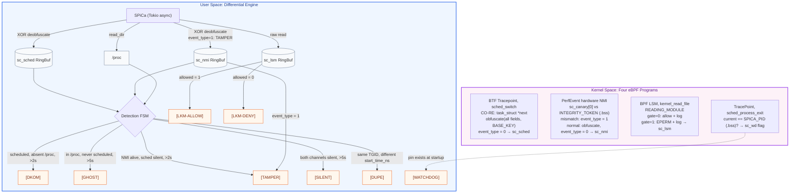
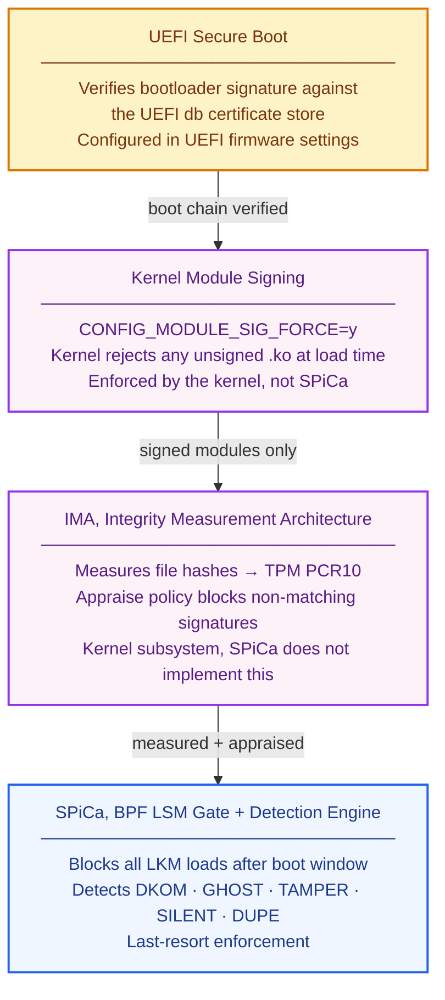

# SPiCa
**System Process Integrity & Cross-view Analysis**

<p align="center">
  
</p>

> "I'm going to sing, so shine bright, SPiCa..."

SPiCa is an eBPF-based Linux rootkit detector written in Rust. The name comes from the Hatsune Miku song *SPiCa* and the star it references — Spica (Alpha Virginis), the brightest point in Virgo. What looks like a single star to the naked eye is actually a spectroscopic binary: two stars in mutual orbit, indistinguishable as separate objects without measuring their spectra. SPiCa applies the same idea to kernel observation: two independent channels (a software tracepoint and a hardware NMI) measure the same kernel state from two physically distinct mechanisms, and a rootkit that suppresses one is exposed by the other.

> **Disclaimer:** Significant portions of this codebase were generated or refactored with GLM assistance. Rigorous testing and iterative design were applied, but review the code for security and performance before production use.

---

## Threat Model

SPiCa is an **auditor with a prevention layer**. The primary enduring value is cross-view detection: a rootkit that bypasses prevention controls still gets caught by the observation channels. The prevention layer (a BPF LSM gate that blocks LKM loading after boot) is one defense; the detection logic is what holds the line when prevention is bypassed by a kernel exploit or unusual configuration.

**The constrained adversary SPiCa is designed to defeat:** the eBPF rootkit. With LKMs blocked by the LSM gate, the remaining way for an adversary with elevated privileges to run in Ring 0 is to load a privileged eBPF program. eBPF programs are verifier-bounded: they cannot hook kernel functions, cannot modify `task_struct` fields, cannot perform arbitrary pointer arithmetic. This is a fundamentally weaker adversary than an LKM rootkit. SPiCa's anti-evasion machinery is calibrated for this constrained threat.

**Non-goals:**
- Nation-state kernel exploits (memory corruption yielding arbitrary kernel write without `init_module`) — SPiCa raises the floor against these by blocking the easier LKM vector but does not ceiling the adversary.
- Defeating a hostile LKM that loaded *before* SPiCa started — defense in depth (Secure Boot, module signing, IMA) is required for the boot window.

SPiCa is the **last-resort layer** in a defense-in-depth stack, not a substitute for the layers above it.

---

## Architecture

SPiCa runs four eBPF programs attached to kernel hooks, plus a userspace detection engine that cross-correlates their output against the system's view of itself (`/proc`).

### The sched_switch channel

An eBPF program attached to the `sched_switch` BTF tracepoint fires every time the kernel schedules a process onto a CPU. It reads the incoming `task_struct *next` pointer directly from the tracepoint argument via CO-RE (`bpf_probe_read_kernel`), extracting `pid`, `tgid`, `comm`, and the process birth timestamp from `group_leader->start_time`.

The program deliberately avoids `bpf_get_current_pid_tgid()` and `bpf_get_current_comm()` in this context. At `sched_switch` time, "current" is the *outgoing* task, not the incoming one being observed. These helpers return the wrong process, and they are themselves hookable. CO-RE reads of the `task_struct` pointer from the tracepoint argument bypass both problems.

### The NMI channel

A perf event on `HW_CPU_CYCLES` fires at hardware interrupt level (~100-300 Hz depending on CPU speed). NMIs cannot be disabled with `cli` — suppressing them requires reprogramming the PMU, a loud and destabilizing operation. The NMI channel provides a hardware-level heartbeat independent of the `sched_switch` software path. It also performs the integrity canary check described below.

### The BPF LSM gate (prevention layer)

A BPF LSM hook on `kernel_read_file` intercepts all `READING_MODULE` operations and returns `-EPERM` once `sc_gate[0]` is set. The flag is set immediately after SPiCa seeds its process registry from `/proc` at startup. Any `insmod` or `modprobe` call after this point fails regardless of caller capabilities. The hook detaches automatically when SPiCa exits — it does not permanently modify kernel behavior.

The gate requires `CONFIG_BPF_LSM=y` and `lsm=bpf` (or `lsm=...,bpf`) in the kernel command line. If BPF LSM is unavailable, SPiCa logs a critical warning and runs in detection-only mode (the LKM vector is not blocked, but the detection channels still function).

### The watchdog (forensic kill evidence)

A tracepoint on `sched_process_exit` fires when any process exits. It reads the exiting TGID via `bpf_get_current_pid_tgid()` (safe here because "current" is genuinely the dying process), and compares it against SPiCa's own TGID stored in the `.bss` global `SPICA_PID`. On match, it sets a flag in `sc_wd`, a named BPF map pinned to `/sys/fs/bpf/spica_watchdog`. BPF filesystem pins outlive the process that created them — even after SIGKILL closes all file descriptors, the pinned map remains. On the next startup, SPiCa checks for the pin and reports whether the prior instance was killed ungracefully.

### Architectural parallel

This design echoes what cloud providers learned about isolation: AWS Nitro removes the hypervisor from the guest's attack surface, Google Titan establishes a hardware root of trust below the software stack. SPiCa applies the same insight at the kernel level — put the security boundary below the level at which the adversary operates.

---

## Detection Classes


```mermaid
graph TD
    subgraph RING0["Kernel Space: Four eBPF Programs"]
        direction TB
        SCHED_P["BTF Tracepoint, sched_switch<br/>CO-RE: task_struct *next<br/>obfuscate(all fields, BASE_KEY)<br/>event_type = 0 → sc_sched"]
        NMI_P["PerfEvent hardware NMI<br/>sc_canary[0] vs INTEGRITY_TOKEN (.bss)<br/>mismatch: event_type = 1<br/>normal: obfuscate, event_type = 0 → sc_nmi"]
        LSM_P["BPF LSM, kernel_read_file<br/>READING_MODULE<br/>gate=0: allow + log<br/>gate=1: EPERM + log → sc_lsm"]
        WATCH_P["TracePoint, sched_process_exit<br/>current == SPICA_PID (.bss)? → sc_wd flag"]
    end

    subgraph RING3["User Space: Differential Engine"]
        ENGINE["SPiCa (Tokio async)"] -->|XOR deobfuscate| RB_S[(sc_sched RingBuf)]
        ENGINE -->|XOR deobfuscate<br/>event_type=1: TAMPER| RB_N[(sc_nmi RingBuf)]
        ENGINE -->|raw read| RB_L[(sc_lsm RingBuf)]
        ENGINE -->|read_dir| PROC[" /proc"]
        RB_S --> FSM{Detection FSM}
        RB_N --> FSM
        PROC --> FSM
        FSM -->|scheduled, absent /proc, >2s| D1["[DKOM]"]
        FSM -->|in /proc, never scheduled, >5s| D2["[GHOST]"]
        FSM -->|NMI alive, sched silent, >2s| D3["[TAMPER]"]
        FSM -->|both channels silent, >5s| D4["[SILENT]"]
        FSM -->|same TGID, different start_time_ns| D5["[DUPE]"]
        RB_N -->|event_type = 1| D3
        RB_L -->|allowed = 1| D7["[LKM-ALLOW]"]
        RB_L -->|allowed = 0| D8["[LKM-DENY]"]
        WATCH_P -.->|pin exists at startup| D6["[WATCHDOG]"]
    end

    classDef kernbox  fill:#fdf2f8,stroke:#9333ea,stroke-width:2px,color:#581c87;
    classDef userbox  fill:#eff6ff,stroke:#2563eb,stroke-width:2px,color:#1e3a8a;
    classDef alertbox fill:#fff7ed,stroke:#ea580c,stroke-width:1px,color:#7c2d12;
    classDef storage  fill:#f8fafc,stroke:#64748b,stroke-width:1px;
    class RING0 kernbox;
    class RING3 userbox;
    class D1,D2,D3,D4,D5,D6,D7,D8 alertbox;
    class RB_S,RB_N,RB_L,PROC storage;
```

| Alert | Condition | What it detects |
|-------|-----------|-----------------|
| `[DKOM]` | Kernel-scheduled TGID absent from `/proc` for >2 s | Direct Kernel Object Manipulation, process hidden from userspace enumeration |
| `[GHOST]` | TGID present in `/proc` but never seen by any eBPF channel for >5 s | `/proc` spoofing, fake entry inserted to pass DKOM checks |
| `[TAMPER]` | NMI alive but `sched_switch` silent for >2 s; or NMI emits `event_type=1` integrity sentinel | Tracepoint suppression, or rootkit intercepted a `bpf_map_update_elem` call for the integrity canary |
| `[SILENT]` | Both channels dark on a previously-observed TGID for >5 s | Total eBPF observation loss |
| `[DUPE]` | Same TGID, different `start_time_ns` across events | `task_struct` field spoofing, rootkit patches `tgid` to impersonate a legitimate process |
| `[WATCHDOG]` | `/sys/fs/bpf/spica_watchdog` pin exists at startup | Previous instance was killed ungracefully (SIGKILL, OOM, crash) |
| `[LKM-ALLOW]` | `READING_MODULE` call intercepted while gate is open (boot window) | Audit record: module loaded before gate locked |
| `[LKM-DENY]` | `READING_MODULE` call intercepted while gate is locked | `insmod`/`modprobe` blocked post-init |

A 50 ms grace window prevents false positives on freshly-forked processes. All per-TGID alerts have a 30 s cooldown to prevent log flooding.

---

## Key Management & Obfuscation

### TPM-sourced key

On TPM-equipped hosts, the XOR obfuscation key is sourced from `TPM2_GetRandom` via the [`tss-esapi`](https://docs.rs/tss-esapi) crate (direct library call to `libtss2-esys`). The key transits no pipe, no subprocess command line, no disk. It exists only in TPM hardware and in kernel volatile memory for the duration of the SPiCa process.

On hosts without a TPM (VMs, containers, machines without a TPM chip), SPiCa falls back to a per-build compile-time key generated from `/dev/urandom` by the build script. The fallback is **visibly loud** at startup:

```
[KEY]        ╔════════════════════════════════════════════╗
[KEY]        ║  INSECURE MODE — TPM UNAVAILABLE            ║
[KEY]        ║  Compile-time key in use.                  ║
[KEY]        ║  Recoverable from the binary.              ║
[KEY]        ║  Install on a TPM-equipped host for prod.  ║
[KEY]        ╚════════════════════════════════════════════╝
```

In INSECURE MODE the key is recoverable from the binary by static analysis. The compile-time encoding (a `u64` hex literal compiled to an 8-byte immediate) is a speed bump, not real protection. **PCR-bound key sealing (real hardware attestation) is on the roadmap, not in the current implementation.** The current TPM use is `GetRandom` only — no PCRs are read, no policy sessions, no sealed objects.

### `.bss` placement — verifier-bounded address secrecy

Three values live in the eBPF program's `.bss` section, written by userspace via `set_global()` before any program is loaded into the kernel:

- `BASE_KEY` — the XOR obfuscation key
- `SPICA_PID` — SPiCa's own TGID, used by the watchdog to avoid a separately-enumerable named map
- `INTEGRITY_TOKEN` — the expected integrity canary value (SipHash-1-3 derivation of `BASE_KEY`)

Named BPF maps are enumerable via the `bpf()` syscall's map iteration interface; `.bss` globals are not. They do not appear in `/proc/kallsyms`. An eBPF adversary with verifier-bounded compute lacks both the *information* (where the address lives) and the *primitives* (unbounded memory scan) to discover them. The verifier bounds loop counts, and `bpf_probe_read_kernel` requires a known source address.

This is **obscurity under capability restriction, not cryptographic secrecy**. An LKM could find the key trivially via unbounded kernel memory scan, but LKMs are blocked by the LSM gate. The defense is calibrated for the constrained eBPF adversary, not for an adversary with arbitrary kernel read. The framing is intentionally honest about what it is and isn't.

### XOR obfuscation — read-leakage defense, not encryption

All `ProcessInfo` fields are XOR-folded with the 64-bit `BASE_KEY` before being written to the ring buffer. The `event_type` field is intentionally left unobfuscated so userspace can read it as a sentinel before deobfuscating the rest.

This is **obfuscation against read-leakage, not encryption against a capable adversary**. XOR with an 8-byte repeating key is structurally vulnerable to known-plaintext: predictable `comm` values (`"bash"`, `"systemd"`, `"kthreadd"`) XOR'd against the ciphertext recover the key bytes directly, no brute force required. The defense is appropriate for the constrained eBPF adversary (who can't easily read the ring buffer in the first place — it requires the same capability gap that protects `.bss`), not for an adversary with binary access + ring buffer interception.

### NMI canary — map-write tampering detection

`.bss` protection doesn't cover named maps (ring buffers, the watchdog pin, the gate). A rootkit could hook `bpf_map_update_elem` and silently intercept writes. SPiCa detects this with a canary: at startup, userspace writes `INTEGRITY_TOKEN` (SipHash-1-3 of `BASE_KEY`) to both `.bss` (unreachable) and the named map `sc_canary` (the tamper target). On every NMI tick, the NMI program reads `sc_canary[0]` and compares to `INTEGRITY_TOKEN` from `.bss`. Divergence means the write was intercepted — the NMI emits an `event_type=1` sentinel and userspace fires `[TAMPER]`.

Forging the correct `sc_canary` value requires knowing `INTEGRITY_TOKEN`. `INTEGRITY_TOKEN` is SipHash output keyed by `BASE_KEY`, so `sc_canary[0]` (readable by root) reveals only the hash, not the key. Inverting SipHash-1-3 to recover `BASE_KEY` is computationally infeasible. Every interception either produces a detectable mismatch or requires finding `BASE_KEY` in `.bss`, which requires the verifier-bounded address discovery the adversary can't perform.

---

## Defense in Depth

SPiCa is the **last enforcement layer**. It complements a properly configured system, not replaces the layers above. If you skip the layers below, SPiCa's gate alone is all that stands between an attacker with root and arbitrary kernel code execution.


```mermaid
flowchart TD
    SB["UEFI Secure Boot<br/>─────────────────────────────<br/>Verifies bootloader signature against<br/>the UEFI db certificate store<br/>Configured in UEFI firmware settings"]
    MS["Kernel Module Signing<br/>─────────────────────────────<br/>CONFIG_MODULE_SIG_FORCE=y<br/>Kernel rejects any unsigned .ko at load time<br/>Enforced by the kernel, not SPiCa"]
    IMA["IMA, Integrity Measurement Architecture<br/>─────────────────────────────<br/>Measures file hashes → TPM PCR10<br/>Appraise policy blocks non-matching signatures<br/>Kernel subsystem, SPiCa does not implement this"]
    SPICA["SPiCa, BPF LSM Gate + Detection Engine<br/>─────────────────────────────<br/>Blocks all LKM loads after boot window<br/>Detects DKOM · GHOST · TAMPER · SILENT · DUPE<br/>Last-resort enforcement"]

    SB  -->|"boot chain verified"| MS
    MS  -->|"signed modules only"| IMA
    IMA -->|"measured + appraised"| SPICA

    classDef firmware fill:#fef3c7,stroke:#d97706,stroke-width:2px,color:#78350f
    classDef kernel   fill:#fdf2f8,stroke:#9333ea,stroke-width:2px,color:#581c87
    classDef spica    fill:#eff6ff,stroke:#2563eb,stroke-width:2px,color:#1e3a8a
    class SB firmware
    class MS,IMA kernel
    class SPICA spica
```

SPiCa checks all four layers at startup and prints their status:

```
[STACK]      Secure Boot ...............  OK
[STACK]      Module signing (SIG_FORCE)   MISSING
[STACK]      IMA active .................  OK
[STACK]      IMA module appraise policy   MISSING
[WARN]       One or more security stack layers are missing.
[WARN]       SPiCa's BPF gate is a last-resort control, not a substitute.
```

**If you need dynamic runtime module loading**, do not disable SPiCa's gate. Instead enforce signature-based module loading at the kernel level via IMA appraisal:
- Boot cmdline: `ima_policy=appraise_tcb ima_appraise=enforce`
- IMA policy rule: `appraise func=MODULE_CHECK appraise_type=imasig`
- Sign modules: `evmctl ima_sign --key local_ima.key module.ko`

This permits signed runtime modules while blocking unsigned ones. SPiCa's gate then becomes belt-and-suspenders on top of IMA rather than the only control.

---

## Build & Run

### Prerequisites

- Linux kernel ≥ 5.15 with `CONFIG_DEBUG_INFO_BTF=y`
- For module blocking: `CONFIG_BPF_LSM=y` and `lsm=bpf` in kernel cmdline
- TPM 2.0 chip + `tpm2-tss` library (optional; falls back with visible warning)
- Nightly Rust toolchain

Verify BPF LSM is active: `cat /sys/kernel/security/lsm` should contain `bpf`.

### Setup

```shell
make install-deps     # system packages + nightly Rust (pacman/apt/dnf auto-detected)
make install-tools    # bpf-linker + aya-tool
make all              # generate-vmlinux → build
```

### Run

```shell
make run              # sudo ./target/release/spica
```

### Install to initramfs (early-boot protection)

To lock module loading before the root filesystem mounts, install SPiCa into your initramfs:

```shell
sudo make install     # spica install — auto-detects Debian (initramfs-tools) or Fedora (dracut)
```

This copies the binary to `/usr/local/bin/spica`, installs the distro-appropriate hooks, and rebuilds the initramfs. `sudo make uninstall` reverses it cleanly.

### Verify it's working

```shell
sudo insmod some_module.ko    # should fail with EPERM (gate locked)
cat /sys/kernel/security/lsm  # should contain 'bpf'
ls /sys/fs/bpf/spica_watchdog # exists if previous run was killed ungracefully
```

### Mac development

The eBPF programs cannot run on macOS. `cargo check` and unit tests for the detection logic work; full runtime verification requires Linux.

```shell
make check      # cargo check for workspace + eBPF target
make test       # unit tests for detection FSM, key derivation, obfuscation
```

---

## Roadmap

- **PCR-bound key sealing** — real hardware attestation. At install time, seal the key to expected PCR values (PCR 7 for Secure Boot state, PCR 2-5 for bootloader/kernel). At runtime, unseal fails if PCRs changed. Replaces the current `GetRandom`-only TPM use with full hardware root of trust.
- **SipHash PRF obfuscation upgrade** — if the threat model grows to include adversaries with ring buffer read access, swap XOR for a SipHash-1-3 keystream (the `siphasher` dep is already in the tree for the integrity token).
- **Additional distro support** — Arch (mkinitcpio), openSUSE. Currently `spica install` supports Debian/Ubuntu (initramfs-tools) and Fedora/RHEL (dracut).
- **CI pipeline** — Linux smoke tests exercising real eBPF load + attach + ring buffer flow.

---

## License

**SPiCa Engine License:** [MIT OR Apache-2.0](Cargo.toml) (workspace). The eBPF program exports a GPL license via the `_license` static — this is a kernel requirement for eBPF programs that use GPL-licensed helpers, and applies only to the loaded eBPF bytecode, not the userspace binary.

**Character Attribution:**
"Hatsune Miku" and associated character artwork are copyrighted properties of Crypton Future Media, INC. (www.piapro.net). This project is an independent, non-commercial research tool, not affiliated with Crypton Future Media. Character used under the [Piapro Character License (PCL)](https://piapro.jp/license/pcl/summary).

The SPiCa project name is inspired by the original song by Toku-P.
