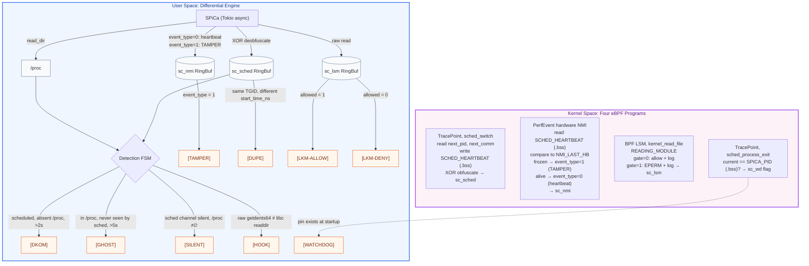
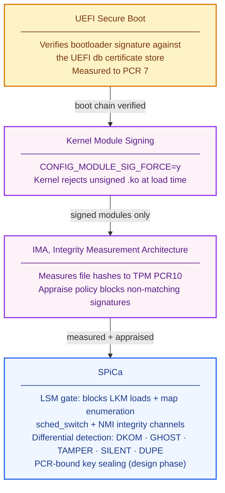

# SPiCa
**System Process Integrity & Cross-view Analysis**

<p align="center">
  
</p>

> "I'm going to sing, so shine bright, SPiCa..."

SPiCa is an eBPF-based Linux rootkit detector written in Rust. The name comes from the Hatsune Miku song *SPiCa* and the star it references — Spica (Alpha Virginis), the brightest point in Virgo. What looks like a single star to the naked eye is actually a spectroscopic binary: two stars in mutual orbit, indistinguishable as separate objects without measuring their spectra. SPiCa applies the same principle to kernel observation: multiple independent channels measure the same kernel state from physically distinct mechanisms, and a rootkit that suppresses one is exposed by the others.

> **Disclaimer:** Significant portions of this codebase were generated or refactored with GLM assistance. Rigorous testing and iterative design were applied, but review the code for security and performance before production use.

---

## Table of Contents

1. [Threat Model](#1-threat-model)
2. [Architecture Overview](#2-architecture-overview)
3. [The sched\_switch Observation Channel](#3-the-sched_switch-observation-channel)
4. [The NMI Integrity Channel](#4-the-nmi-integrity-channel)
5. [Detection Logic](#5-detection-logic)
6. [Verifier-Bounded Address Secrecy](#6-verifier-bounded-address-secrecy)
7. [LSM Map-Access Gate](#7-lsm-map-access-gate)
8. [Key Management & Obfuscation](#8-key-management--obfuscation)
9. [PCR-Bound TPM Sealing (Design)](#9-pcr-bound-tpm-sealing-design)
10. [Defense in Depth](#10-defense-in-depth)
11. [The BTF Bug Incident](#11-the-btf-bug-incident)
12. [Known Limitations & Attack Surface](#12-known-limitations--attack-surface)
13. [Build & Run](#13-build--run)
14. [Roadmap](#14-roadmap)
15. [Glossary](#15-glossary)

---

## 1. Threat Model

### The constrained adversary: the eBPF rootkit

SPiCa is designed to defeat the **eBPF-constrained adversary** — an attacker with elevated privileges (CAP\_BPF or CAP\_SYS\_ADMIN) who loads a privileged eBPF program into the kernel. This adversary is fundamentally weaker than an LKM rootkit because the BPF verifier imposes hard constraints:

| Constraint | Effect on adversary |
|---|---|
| Bounded loops (~1M instructions per program) | Cannot scan all of kernel memory |
| Pointer safety (direct dereference requires provably valid, bounded target) | Cannot follow arbitrary pointers |
| Restricted helpers (per-program-type allowlist) | Cannot call `kmalloc`, `vmalloc`, or any kernel allocation function |
| No arbitrary kernel write (`bpf_probe_write_kernel` heavily restricted) | Cannot modify `task_struct`, tracepoint funcs arrays, or BPF program bytecode |
| Map access scoped to loaded references | Cannot access maps belonging to other programs (unless enumerated by ID — see [§7](#7-lsm-map-access-gate)) |

With LKMs blocked by the LSM gate after boot, this constrained adversary is the realistic remaining threat. SPiCa's anti-evasion machinery is calibrated for this threat — every defense is honest about what it covers and what it doesn't.

### Non-goals

- **Nation-state kernel exploits** — memory corruption yielding arbitrary kernel write without `init_module`. SPiCa raises the floor by blocking the easier LKM vector but does not ceiling the adversary.
- **Hostile LKMs loaded before SPiCa started** — defense in depth (Secure Boot, module signing, IMA) is required for the boot window.
- **Verifier exploits** — if the BPF verifier is unsound (historical CVEs: CVE-2020-27194, CVE-2022-23222, CVE-2023-2163), the adversary escapes the constrained model into arbitrary kernel code execution. This is a separate threat class. SPiCa's defenses hold under a *correct* verifier.

SPiCa is the **last-resort layer** in a defense-in-depth stack, not a substitute for the layers above.

---

## 2. Architecture Overview

SPiCa runs four eBPF programs attached to kernel hooks, plus a userspace detection engine that cross-correlates their output against the system's view of itself (`/proc`).

### Three observation channels, each suppressible only by a mechanism of escalating cost

| Channel | Mechanism | What suppresses it | Cost of suppression |
|---|---|---|---|
| `/proc` | procfs directory enumeration | DKOM (unlink process from task list) | Low — well-understood rootkit technique |
| `sched_switch` | eBPF tracepoint on the scheduler | Detach program from funcs array; filter context | Medium — requires kernel write to funcs array |
| NMI | Hardware perf counter interrupt → eBPF perf event | Hook the IDT/NMI handler | **Near-certain kernel panic** — hardware interrupt, not maskable |

The key architectural property: **a rootkit cannot suppress all three channels simultaneously without the suppression itself becoming detectable or destabilizing.** Suppressing NMI requires patching the IDT (Interrupt Descriptor Table), which panics on most kernels. This is the "live bomb" — the attacker's only path to total blindness is one that likely crashes the system.

### Detection model — three sentences

```
sched sees it, /proc doesn't              → DKOM
NMI finds sched's heartbeat stopped       → TAMPER
sched goes globally silent, /proc != empty → SILENT
```

Each detection class is a differential verdict: a discrepancy between two or more channels. The detection engine is a pure function over the registry + /proc snapshot + channel timestamps — no I/O, no side effects, fully unit-testable.

### The NMI redesign: from observation to integrity

In the original design, NMI was a second process-observation channel that sampled the CPU and reported which task was running. This was redundant: sched\_switch already observes scheduling, and NMI sampled the same data via a different mechanism. The redundancy cost ~1000+ ring-buffer events/sec/CPU of process data that 99.999% of the time confirmed "yes, the scheduler is doing what the scheduler does."

In the redesigned architecture, **NMI is repurposed from process observation to tracepoint integrity verification.** It no longer reports which process is on the CPU. Instead, it verifies that `sched_switch` is actually running by reading a shared `.bss` heartbeat. This:

1. Eliminates ~99% of NMI ring-buffer traffic (near-zero steady-state events)
2. Directly detects tracepoint detachment, suppression, and BTF/attach failures (the original BTF bug — see [§11](#11-the-btf-bug-incident))
3. Runs from a hardware interrupt, outside the tracepoint dispatch path — immune to `bpf_override_return`, kprobe interception, and funcs-array manipulation
4. Reads `.bss` globals via direct memory access, not BPF helpers — immune to `fmod_ret` on helper functions

---

## 3. The sched\_switch Observation Channel

An eBPF program attached to the `sched_switch` tracepoint fires every time the kernel schedules a process onto a CPU. It reads the incoming task's PID and comm directly from the tracepoint arguments using traditional (non-BTF) fixed-offset reads:

```
ctx.read_at::<u32>(56)    → next_pid
ctx.read_at::<[u8;16]>(40) → next_comm
```

**Deliberately not BTF/CO-RE.** The tracepoint argument layout is stable across kernel versions (it's part of the tracepoint ABI). Using hardcoded offsets avoids the kernel-version fragility of BTF-resolved struct navigation. This is a deliberate design choice documented in [§11](#11-the-btf-bug-incident).

On every invocation, the program:

1. Reads `next_pid` and `next_comm` from the tracepoint context
2. Filters out the idle task (PID 0)
3. XOR-obfuscates the `ProcessInfo` struct with `BASE_KEY`
4. Submits to the `sc_sched` ring buffer
5. **Writes `bpf_ktime_get_ns()` to the `.bss` global `SCHED_HEARTBEAT`** — the heartbeat that the NMI integrity checker monitors

The program deliberately avoids `bpf_get_current_pid_tgid()` in this context. At `sched_switch` time, "current" is the *outgoing* task, not the incoming one. The tracepoint arguments provide the correct (incoming) process identity.

### Time-base discipline

The detection engine uses a single monotonic time base: nanoseconds since SPiCa's process startup (`Instant::now()` since `run_detection()` entry). When a sched event arrives, the event handler stores **the caller-provided `now`** (process-local nanos), not the eBPF `bpf_ktime_get_ns()` value embedded in the event. This avoids the time-base mismatch that would occur if kernel boot time were mixed with process-local time — a bug that was present in earlier versions and caused all liveness predicates to silently fail.

---

## 4. The NMI Integrity Channel

### Design: .bss heartbeat, no BTF, no kernel struct walking

The NMI program is attached to a hardware perf counter (`HW_CPU_CYCLES`) that fires at hardware interrupt level. NMIs cannot be disabled with `cli` — suppressing them requires reprogramming the PMU or hooking the IDT, both of which are loud and destabilizing.

The integrity check mechanism is dead simple:

```
.bss (shared within SPiCa's ELF object — all programs see the same memory):
  SCHED_HEARTBEAT   ← written by sched_switch on every invocation
  NMI_LAST_HB       ← NMI's record of the last heartbeat it observed
  NMI_FIRST_TICK    ← first NMI invocation timestamp (grace period reference)
  NMI_LAST_EMIT     ← throttle: last event emission timestamp

sched_switch runs → SCHED_HEARTBEAT = bpf_ktime_get_ns()

NMI fires (once per second, throttled):
  if SCHED_HEARTBEAT == NMI_LAST_HB:
    if past grace period (5 seconds since first NMI tick):
      → sched_switch stopped running → emit event_type=1 (TAMPER)
  else:
    → sched_switch is alive → emit event_type=0 (heartbeat OK)
  NMI_LAST_HB = SCHED_HEARTBEAT
```

### Why this detects every attack in scope

| Attack | What happens | What NMI sees |
|---|---|---|
| Tracepoint detached from funcs array | sched\_switch stops executing | `SCHED_HEARTBEAT` freezes → TAMPER |
| BTF bug / attach failure (silent) | sched\_switch never executes | `SCHED_HEARTBEAT` stays 0 → TAMPER (after grace) |
| `bpf_override_return` on a scheduler function | If it prevents the tracepoint from firing | `SCHED_HEARTBEAT` freezes → TAMPER |
| Bytecode patched in-place | Requires arbitrary kernel write (LKM-level) | Outside the eBPF threat model |
| Ring buffer consumer pointer manipulated | sched events don't reach userspace | `SCHED_HEARTBEAT` still advances (the program runs) → no false TAMPER; userspace detects via `max(sched_last)` stale → SILENT |

### Why `.bss` specifically

`.bss` globals are stored in the BPF program's internal data section, backed by an internal array map that the loader manages. They are:

- **Not separately pinnable** — they don't appear as named maps in `/sys/fs/bpf/`
- **Not interceptable via `bpf_map_update_elem` hooks** — `.bss` writes are direct memory stores, not map-update syscalls. The old `sc_canary` mechanism (comparing a `.bss` copy against a named-map copy to detect `bpf_map_update_elem` interception) is no longer needed.
- **Shared between programs in the same ELF object** — sched\_switch and NMI communicate through `.bss` without any external interface

### Immunity to BPF-based interception

The NMI integrity checker is structurally immune to BPF override attacks because of a fundamental property: `bpf_override_return` intercepts function **calls**, but the NMI checker doesn't *call* the things it verifies — it *reads `.bss` memory directly*. You cannot override the return value of a memory read because a memory read is not a function call.

Additionally:
- `bpf_probe_read_kernel` (used for kernel struct reads in alternative designs) is a fault-safe helper that accepts any address — but SPiCa's `.bss` heartbeat design doesn't even need it. The checker reads `.bss` globals via direct load instructions.
- The NMI program runs in NMI context, where kprobes are structurally unreliable (the kernel defers or suppresses them). A kprobe-based attack against the checker's execution fights the hardware.

### NMI event semantics

The NMI ring buffer (`sc_nmi`) carries lightweight events:

| `event_type` | Meaning | Userspace action |
|---|---|---|
| 0 | Heartbeat — NMI alive, sched\_switch alive | Update `last_nmi_heartbeat` timestamp |
| 1 | TAMPER — NMI alive, sched\_switch heartbeat frozen | Print `[TAMPER]` immediately |

Events are emitted at most once per second (throttled by `NMI_LAST_EMIT`). If the NMI ring buffer goes silent for >5 seconds, userspace fires `[SILENT]` — the NMI channel itself is dead.

---

## 5. Detection Logic


```mermaid
graph TD
    subgraph RING0["Kernel Space: Four eBPF Programs"]
        direction TB
        SCHED_P["TracePoint, sched_switch<br/>read next_pid, next_comm<br/>write SCHED_HEARTBEAT (.bss)<br/>XOR obfuscate → sc_sched"]
        NMI_P["PerfEvent hardware NMI<br/>read SCHED_HEARTBEAT (.bss)<br/>compare to NMI_LAST_HB<br/>frozen → event_type=1 (TAMPER)<br/>alive → event_type=0 (heartbeat)<br/>→ sc_nmi"]
        LSM_P["BPF LSM, kernel_read_file<br/>READING_MODULE<br/>gate=0: allow + log<br/>gate=1: EPERM + log → sc_lsm"]
        WATCH_P["TracePoint, sched_process_exit<br/>current == SPICA_PID (.bss)? → sc_wd flag"]
    end

    subgraph RING3["User Space: Differential Engine"]
        ENGINE["SPiCa (Tokio async)"] -->|XOR deobfuscate| RB_S[(sc_sched RingBuf)]
        ENGINE -->|event_type=0: heartbeat<br/>event_type=1: TAMPER| RB_N[(sc_nmi RingBuf)]
        ENGINE -->|raw read| RB_L[(sc_lsm RingBuf)]
        ENGINE -->|read_dir| PROC[" /proc"]
        RB_S --> FSM{Detection FSM}
        PROC --> FSM
        FSM -->|scheduled, absent /proc, >2s| D1["[DKOM]"]
        FSM -->|in /proc, never seen by sched, >5s| D2["[GHOST]"]
        RB_N -->|event_type = 1| D3["[TAMPER]"]
        FSM -->|sched channel silent, /proc ≠∅| D4["[SILENT]"]
        FSM -->|raw getdents64 ≠ libc readdir| D9["[HOOK]"]
        RB_S -->|same TGID, different start_time_ns| D5["[DUPE]"]
        RB_L -->|allowed = 1| D7["[LKM-ALLOW]"]
        RB_L -->|allowed = 0| D8["[LKM-DENY]"]
        WATCH_P -.->|pin exists at startup| D6["[WATCHDOG]"]
    end

    classDef kernbox  fill:#fdf2f8,stroke:#9333ea,stroke-width:2px,color:#581c87;
    classDef userbox  fill:#eff6ff,stroke:#2563eb,stroke-width:2px,color:#1e3a8a;
    classDef alertbox fill:#fff7ed,stroke:#ea580c,stroke-width:1px,color:#7c2d12;
    classDef storage  fill:#f8fafc,stroke:#64748b,stroke-width:1px;
    class RING0 kernbox;
    class RING3 userbox;
    class D1,D2,D3,D4,D5,D6,D7,D8,D9 alertbox;
    class RB_S,RB_N,RB_L,PROC storage;
```

| Alert | Condition | What it detects |
|-------|-----------|-----------------|
| `[DKOM]` | Kernel-scheduled TGID absent from `/proc` for >2 s | Direct Kernel Object Manipulation — process hidden from userspace enumeration |
| `[GHOST]` | TGID present in `/proc` but never seen by `sched_switch` for >5 s | `/proc` spoofing — fake entry inserted to pass DKOM checks |
| `[TAMPER]` | NMI detects `sched_switch` heartbeat frozen (event\_type=1) | Tracepoint detached, suppressed, or BTF/attach failure |
| `[SILENT]` | `max(sched_last)` stale across entire registry while `/proc` is non-empty; or NMI heartbeat absent for >5 s | Channel-level observation loss — sched or NMI channel is dead |
| `[DUPE]` | Same TGID, different `start_time_ns` across events | `task_struct` field spoofing — rootkit patches `tgid` to impersonate a legitimate process |
| `[HOOK]` | PIDs visible via raw `getdents64` but absent from libc `readdir` | **LD_PRELOAD rootkit** — userspace library interception hiding processes from `ps`, `ls`, and other tools (Symbiote, JynxKit, Azazel, Medusa/OrBit) |
| `[WATCHDOG]` | `/sys/fs/bpf/spica_watchdog` pin exists at startup | Previous instance was killed ungracefully (SIGKILL, OOM, crash) |
| `[LKM-ALLOW]` | `READING_MODULE` intercepted while gate is open (boot window) | Audit record: module loaded before gate locked |
| `[LKM-DENY]` | `READING_MODULE` intercepted while gate is locked | `insmod`/`modprobe` blocked post-init |

### Channel-level SILENT detection

SILENT is a **channel-level** verdict, not a per-process one. It fires when:

1. **sched channel dead:** `max(sched_last)` over all registry records is stale beyond `CHANNEL_DEAD_NANOS` while `/proc` is non-empty. The non-empty-/proc guard is the liveness guarantee: on any running Linux system, `/proc` is non-empty (init, kernel threads, kworkers), and the scheduler is never truly idle (timer ticks, I/O waiters, RCU callbacks). A stale `max(sched_last)` on a non-empty system means the channel died — not that the system is idle.

2. **NMI channel dead:** No heartbeat event (`event_type=0`) has arrived from the NMI ring buffer for >5 seconds. This means the NMI perf event stopped firing — either the perf event was detached or the PMU was reprogrammed.

Both checks have a 30-second cooldown to prevent alert flooding.

### LD\_PRELOAD rootkit detection (`[HOOK]`)

SPiCa reads `/proc` via **two independent mechanisms** on every tick:

1. **Raw `getdents64` syscall** (`read_tgids()`) — Rust's `std::fs::read_dir` calls this directly via `libc::syscall(SYS_getdents64, ...)`, bypassing all libc function hooks. LD_PRELOAD rootkits cannot intercept this path.

2. **libc `readdir`** (`read_tgids_libc()`) — calls `libc::opendir` / `libc::readdir` via FFI, which goes through the dynamic linker and is fully interceptable by `/etc/ld.so.preload` hooks.

If `getdents64` sees PIDs that libc `readdir` doesn't, a userspace rootkit is hooking `readdir` to hide processes. SPiCa fires `[HOOK]`:

```
[HOOK]       3 PID(s) hidden from libc readdir — LD_PRELOAD rootkit suspected
```

This technique turns SPiCa's kernel-level privilege into an active detection of userspace rootkits. The raw syscall path is the ground truth — no userspace hook can blind it. The libc path is the "perceived" view that a normal tool (ps, ls) would see. The discrepancy is unambiguous proof of library interception.

**Rootkits detected by `[HOOK]`:**

| Rootkit | Hiding mechanism | Detected |
|---------|-----------------|----------|
| Symbiote | Parasitic LD_PRELOAD, hooks `readdir` | Yes (when actively hiding) |
| JynxKit | LD_PRELOAD, `MAGIC_GID` hiding via `readdir` | Yes |
| Azazel | LD_PRELOAD, `readdir` + `stat` hooks | Yes |
| Medusa/OrBit | LD_PRELOAD, `readdir` + credential theft | Yes |

**Tested against real Symbiote:** A live Symbiote sample (SHA256 `f55af21f...`, MalwareBazaar) was deployed via `/etc/ld.so.preload` on an Ubuntu 24.04 VM. The sample hooks `readdir`, `readdir64`, `stat`, `fstatat`, `pam_authenticate`, `pcap_loop`, `recvmsg`, `fopen`, `read`, `execve`. When the LD_PRELOAD hook actively hides a PID from `readdir`, SPiCa fires `[HOOK]` within one tick cycle (<1 s). When Symbiote is loaded but passive (not actively hiding), SPiCa produces zero false positives.

### Grace window

A 50 ms grace window prevents false positives on freshly-forked processes. Channel-level SILENT checks have a 5-second grace period (the NMI program's `NMI_FIRST_TICK` reference) so that startup latency doesn't produce false TAMPER alerts.

---

## 6. Verifier-Bounded Address Secrecy

### Definition

**Verifier-bounded address secrecy** is a computational security property that holds under the eBPF-constrained adversary model. It states:

> Given an adversary who can load eBPF programs (CAP\_BPF) but is constrained by the BPF verifier (bounded loops, restricted helpers, no arbitrary kernel write), the kernel address of a BPF program's `.bss` data section is computationally infeasible to discover.

### The four mechanisms

The property is a composition of four independent barriers:

1. **kASLR** — Kernel Address Space Layout Randomization randomizes the kernel heap region where BPF map memory (including `.bss` backing maps) is allocated. The exact address changes on every boot.

2. **Verifier instruction bound** — The BPF verifier bounds total instructions per program to ~1 million and requires provably terminating loops. An adversary's scanning program can probe at most N ≈ 10^6 addresses per load via `bpf_probe_read_kernel`. Given a kASLR-randomized search space, per-program success probability is negligible.

3. **LSM map-access gate** (see [§7](#7-lsm-map-access-gate)) — Without the gate, an adversary could enumerate BPF maps by ID (`BPF_MAP_GET_NEXT_ID` → `BPF_MAP_GET_FD_BY_ID` → `BPF_MAP_LOOKUP_ELEM`) and read `.bss` contents directly. The gate removes this easy path, forcing the adversary into the verifier-bounded memory-scan path.

4. **`.bss` placement** — `.bss` globals do not appear in named-map enumeration interfaces with human-readable names. The internal `.bss` backing map is named `.bss` by libbpf/aya, but its contents (the actual global variables) are only accessible if you have the map fd. The map fd requires either the loading process's fd table or the map ID (blocked by the gate).

### Formal argument structure

```
Adversary's goal:    locate SPiCa's .bss in kernel virtual memory
Search space:        kernel heap region, kASLR-randomized (~2^30 entropy)

Path A — map enumeration (blocked):
  BPF_MAP_GET_NEXT_ID → BPF_MAP_GET_FD_BY_ID → BPF_MAP_LOOKUP_ELEM
  → blocked by LSM gate (§7) for non-SPiCa processes

Path B — memory scan (bounded):
  bpf_probe_read_kernel(addr, buf, len) — fault-safe, accepts any addr
  Per-program capacity: N ≈ 10^6 probes (instruction limit)
  Success probability per load: N / |search space| ≈ 10^6 / 2^30 ≈ 10^-24
  Can reload programs, but: each load is a syscall (observable), and
  the target address doesn't change between loads (same boot session)

Path C — timing side channel (theoretical):
  bpf_probe_read_kernel timing varies on fault vs success
  Binary search over the heap could reduce scan complexity to O(log |A|)
  → O(30) probes, well within instruction budget
  LIMITATION: must be acknowledged. Mitigated by rate-limiting BPF_PROG_LOAD
  via the LSM gate (future work).
```

### What makes this novel

Most BPF security research treats the verifier as an **attack surface** (verifier bugs, unsoundness, JIT spray). This work inverts the framing: the verifier's constraints are a **defensive primitive** that bounds the adversary's search space. The secrecy isn't cryptographic (it's not AES); it's **computational** — bounded by what the verifier permits the adversary to compute.

### Limitations (must be stated honestly)

- **Verifier exploits** — If the verifier is unsound, the instruction bound breaks and the adversary can do arbitrary computation. This is outside the eBPF threat model.
- **Timing side channels** — `bpf_probe_read_kernel` is timing-observable (fault vs. success takes different cycles). A timing-based binary search over the heap is theoretically more efficient than linear scan. The instruction bound limits probes per program, but binary search could reduce the probe count to O(log |A|) ≈ 30. This is a real limitation. Mitigation: rate-limit `BPF_PROG_LOAD` via the LSM gate.
- **Userspace root** — A userspace root process (not constrained by the verifier) can enumerate maps by ID. The LSM gate blocks this, but only for non-SPiCa processes. A process that compromises SPiCa's own PID has full access.

---

## 7. LSM Map-Access Gate

### The problem

`.bss` globals are backed by an internal BPF map. Any process with CAP\_BPF can enumerate all maps on the system:

```
bpf(BPF_MAP_GET_NEXT_ID, …) → iterate all map IDs
bpf(BPF_MAP_GET_FD_BY_ID, id) → get fd to any map
bpf(BPF_MAP_LOOKUP_ELEM, fd, key, value) → read map contents
```

Against the eBPF adversary (who can't call syscalls), `.bss` is hidden. Against userspace root, it's a standard map — fully readable. The LSM gate closes this gap.

### The defense

A BPF LSM hook on the `bpf` syscall checks map-access commands:

```
hook = "bpf"
  read cmd (arg 0)
  if cmd == BPF_MAP_GET_FD_BY_ID:
    read map_id from userspace bpf_attr (bpf_probe_read_user)
    if map_id matches any of SPiCa's stored IDs (.bss):
      if caller_tgid != SPICA_PID:
        return -EPERM
```

Map IDs are written to `.bss` by the userspace loader right after program load, before the LSM hook is armed (same timing pattern as the existing `sc_gate` for LKM blocking). No BTF needed — `cmd` and `map_id` come from syscall arguments, not kernel structs.

**Surgical:** only blocks access to SPiCa's specific map IDs. Other processes' BPF tools (tcpdump, bpftrace, bcc) access their own maps and are unaffected.

### What it doesn't cover

- **ptrace / `/proc/pid/mem`** — Another root process could read SPiCa's process memory directly via ptrace, bypassing the BPF syscall entirely. This is a fundamental limitation: you can't protect against a process with the same privilege level reading your memory via `/proc/pid/mem`. Defense: off-host log shipping (if the attacker can read local memory, they can also suppress local alerts — only remote logging helps).
- **SPiCa's own PID compromised** — If the attacker gains control of SPiCa's process, they have legitimate access to the maps.

---

## 8. Key Management & Obfuscation

### TPM-sourced key

On TPM-equipped hosts, the 64-bit XOR obfuscation key is sourced from `TPM2_GetRandom` via the [`tss-esapi`](https://docs.rs/tss-esapi) crate (direct library call to `libtss2-esys`). The key transits no pipe, no subprocess command line, no disk. It exists only in TPM hardware and in kernel volatile memory (`.bss` backing map) for the duration of the SPiCa process.

On hosts without a TPM (VMs without vTPM, containers, machines without a TPM chip), SPiCa falls back to a per-build compile-time key generated from `/dev/urandom` by the build script. The fallback is **visibly loud** at startup with a warning banner.

### `.bss` placement

The following values live in the eBPF program's `.bss` section, written by userspace via `set_global()` before any program is loaded:

| Global | Purpose | Written by |
|---|---|---|
| `BASE_KEY` | XOR obfuscation key | userspace at load time |
| `SPICA_PID` | SPiCa's own TGID (watchdog) | userspace at load time |
| `SCHED_HEARTBEAT` | sched\_switch liveness timestamp | sched\_switch program on each invocation |
| `NMI_LAST_HB` | NMI's record of last sched heartbeat | NMI program on each check |
| `NMI_FIRST_TICK` | First NMI invocation ktime (grace period) | NMI program on first invocation |
| `NMI_LAST_EMIT` | Throttle: last event emission ktime | NMI program on each emission |

Named BPF maps are enumerable via the `bpf()` syscall's map iteration interface (blocked by the LSM gate — see [§7](#7-lsm-map-access-gate)); `.bss` globals are accessed through the same internal map but are not separately named or pinnable.

### XOR obfuscation — read-leakage defense, not encryption

All `ProcessInfo` fields are XOR-folded with the 64-bit `BASE_KEY` before being written to ring buffers. The `event_type` field is intentionally left unobfuscated so userspace can read it as a sentinel before deobfuscating the rest.

This is **obfuscation against read-leakage, not encryption against a capable adversary.** XOR with an 8-byte repeating key is structurally vulnerable to known-plaintext: predictable `comm` values (`"bash"`, `"systemd"`, `"kthreadd"`) XOR'd against the ciphertext recover key bytes directly. The defense is appropriate for the eBPF adversary (who can't easily read the ring buffer — it requires the same capability gap that protects `.bss`), not for an adversary with binary access + ring buffer interception.

---

## 9. PCR-Bound TPM Sealing (Design)

> **Status:** Design phase. Not yet implemented. This section documents the target architecture for the research paper.

### Overview

PCR-bound TPM sealing moves the key distribution boundary from the software layer into silicon. The key is sealed at install time against expected Platform Configuration Register (PCR) values, and can only be unsealed if the system's boot state matches the expected measurements.

### Boot measurement chain

During boot, the firmware, bootloader, and kernel measure critical components into PCRs:

| PCR | What it measures | Stability |
|---|---|---|
| PCR 4 | Bootloader code + kernel image (GRUB measures both) | Changes on kernel update |
| PCR 5 | GPT/MBR partition table, boot configuration | Stable across updates |
| PCR 7 | Secure Boot policy (SI policy, MOK, db/dbx) | Stable across kernel updates |
| PCR 8 | Kernel command line (systemd-stub measurements) | Stable unless cmdline changes |
| PCR 9 | Initramfs (GRUB measures initrd here) | Changes on initramfs update |
| PCR 10 | IMA measurement list | Changes as executables are measured |

> **Note:** PCR allocation is **boot-chain-dependent**. GRUB measures the kernel to PCR 4; systemd-stub measures to PCR 4 and the command line to PCR 8. The sealing policy must match the target boot chain.

### The seal → unseal → inject → fail-safe flow

1. **Seal (install time):** The 64-bit key is sealed against expected PCR values using `TPM2_Create` with a `TPM2_PolicyPCR` session. The sealed blob is stored on disk. It is encrypted with the TPM's internal key and can only be decrypted when the specified PCRs match.

2. **Unseal (early boot, initramfs stage):** Before any untrusted userspace code executes, SPiCa's initramfs hook requests `TPM2_Unseal`. If the current PCR values match the seal policy, the TPM releases the key.

3. **Inject:** The key is written to `.bss` via `set_global()` before programs are loaded.

4. **The trap:** If an attacker has modified the kernel (PCR 4 mismatch), swapped the initramfs (PCR 9 mismatch), or altered the Secure Boot policy (PCR 7 mismatch), the PCR hashes diverge. The TPM refuses to unseal, and SPiCa **fails safe** — it refuses to start rather than running blind with a compromised key.

### PCR policy options

| Policy | Sealed against | Strength | Operational cost |
|---|---|---|---|
| Strong | PCR 4 + 7 + 9 + 10 | Catches kernel, initramfs, Secure Boot, and IMA changes | Re-seal after every kernel/initramfs update |
| Balanced | PCR 7 + 10 | Catches Secure Boot and IMA appraisal changes; stable across kernel updates | Re-seal only on Secure Boot policy or IMA policy changes |
| Minimal | PCR 7 only | Catches Secure Boot state changes only | Very stable; weakest binding |

For the research paper, present the **strong** policy and discuss the re-seal tradeoff in limitations.

### Relationship to verifier-bounded address secrecy

The two mechanisms are complementary:

- **PCR sealing** protects the key at boot — it ensures the key is only available on a trusted system state.
- **Verifier-bounded address secrecy + LSM gate** protect the key at runtime — they ensure the eBPF adversary can't locate or read the `.bss` where the key lives.

Neither is sufficient alone. PCR sealing doesn't help if the key is compromised at runtime (map enumeration). Address secrecy doesn't help if the system was compromised before SPiCa started (hostile initramfs).

### What PCR sealing does NOT catch

- **Runtime LSM program detachment** — The BPF LSM programs (`spica_lsm_modblock`, the map-access gate) are loaded at runtime and are NOT measured to any PCR. A rootkit that detaches them after boot isn't caught by PCR sealing. What catches that is the NMI heartbeat (detecting that the detection system itself stopped running).
- **Post-boot kernel exploitation** — If the kernel is exploited after boot (memory corruption → arbitrary write), PCRs are unchanged. This is the "nation-state" non-goal.

---

## 10. Defense in Depth

SPiCa is the **last enforcement layer**. It complements a properly configured system, not replaces the layers above.


```mermaid
flowchart TD
    SB["UEFI Secure Boot<br/>─────────────────────────────<br/>Verifies bootloader signature against<br/>the UEFI db certificate store<br/>Measured to PCR 7"]
    MS["Kernel Module Signing<br/>─────────────────────────────<br/>CONFIG_MODULE_SIG_FORCE=y<br/>Kernel rejects unsigned .ko at load time"]
    IMA["IMA, Integrity Measurement Architecture<br/>─────────────────────────────<br/>Measures file hashes to TPM PCR10<br/>Appraise policy blocks non-matching signatures"]
    SPICA["SPiCa<br/>─────────────────────────────<br/>LSM gate: blocks LKM loads + map enumeration<br/>sched_switch + NMI integrity channels<br/>Differential detection: DKOM · GHOST · TAMPER · SILENT · DUPE<br/>PCR-bound key sealing (design phase)"]

    SB  -->|"boot chain verified"| MS
    MS  -->|"signed modules only"| IMA
    IMA -->|"measured + appraised"| SPICA

    classDef firmware fill:#fef3c7,stroke:#d97706,stroke-width:2px,color:#78350f
    classDef kernel   fill:#fdf2f8,stroke:#9333ea,stroke-width:2px,color:#581c87
    classDef spica    fill:#eff6ff,stroke:#2563eb,stroke-width:2px,color:#1e3a8a
    class SB firmware
    class MS,IMA kernel
    class SPICA spica
```

SPiCa checks all four layers at startup and prints their status.

---

## 11. The BTF Bug Incident

### What happened

During testing on Ubuntu (latest kernel), a BTF incompatibility caused the `sched_switch` tracepoint program to attach successfully but **never fire a single event.** The `attach()` syscall returned `Ok(())`, so SPiCa proceeded normally — but the sched ring buffer stayed empty. No detection alerts fired because the detection engine had no scheduling data. **SPiCa ran blind without any indication of failure.**

This is the worst-case failure mode for a security tool: silent blindness.

### Why it wasn't detected

The original detection engine reasoned **per-process**: each process record had `sched_last` and `nmi_last` timestamps, and liveness was computed per-record. When sched\_switch died globally:

1. `sched_live` flipped false for every record (no new sched events → all `sched_last` values age out)
2. The per-process `TAMPER` predicate (`in_proc && nmi_live && !sched_live`) could fire, but required `nmi_live` held *continuously* for 2 seconds. NMI samples sparsely (10M cycle period), so `suspect_since` kept resetting on sampling jitter and never matured.
3. The per-process `SILENT` predicate required `sched_live`, which was now false for everything — the predicate inverted under exactly the condition it was meant to detect.
4. There was **no channel-level liveness check** — no "has sched EVER fired?" or "is max(sched_last) stale?" mechanism.

Additionally, a time-base mismatch was discovered: `sched_last` stored `bpf_ktime_get_ns()` (kernel boot nanoseconds) while `evaluate()` compared against `nanos_since_startup()` (process-local nanoseconds). The `wrapping_sub` of these different time bases produced huge values, making all liveness predicates trivially false. The detection logic had never worked correctly in production — the BTF bug just masked it by preventing events from arriving at all.

### How the redesign fixes it

| Problem | Fix |
|---|---|
| No channel-level liveness check | `evaluate()` now computes `max(sched_last)` and fires `[SILENT]` if stale while `/proc` is non-empty |
| Per-process TAMPER never matured (jitter reset) | TAMPER is now a direct signal from the NMI program (`.bss` heartbeat comparison), not a per-process FSM with thresholds |
| Per-process SILENT inverted when sched died | SILENT is now channel-level, computed from aggregates, not per-record predicates |
| Time-base mismatch | `sched_last` now stores process-local time (`now` parameter), not `bpf_ktime_get_ns()` |
| NMI was redundant observation | NMI is now an integrity checker — it detects sched death directly via `.bss` heartbeat |

---

## 12. Known Limitations & Attack Surface

### Within the eBPF threat model

| Attack | Status | Notes |
|---|---|---|
| **Ring buffer consumer pointer manipulation** | **Detected** (SILENT) | `max(sched_last)` goes stale → SILENT. `SCHED_HEARTBEAT` still advances (program runs) → no false TAMPER. |
| **Perf event struct DKOM** (zero `state` field) | **Detected** (SILENT) | NMI stops firing → no heartbeat events → SILENT on NMI channel |
| **`task_struct` field spoofing** (overwrite pid/tgid) | **Partial** (DUPE) | If the spoofed TGID matches an existing record with a different `start_time_ns`, DUPE fires. If `start_time_ns` is also spoofed, this slips through. |
| **eBPF program detachment** (remove from funcs array) | **Detected** (TAMPER) | NMI heartbeat freezes → TAMPER |
| **Bytecode patched in-place** | **Not detected** | Requires arbitrary kernel write (LKM-level) — outside eBPF threat model |
| **Timing side channel on `bpf_probe_read_kernel`** | **Theoretical risk** | Binary search over heap could find `.bss` in ~30 probes. See [§6](#6-verifier-bounded-address-secrecy) limitations. |

### Outside the eBPF threat model (acknowledged, not solved)

| Attack | Status | Notes |
|---|---|---|
| **IDT/NMI handler hook** | **The live bomb** | Architecturally complete bypass. Near-certain kernel panic. |
| **Dual-channel suppression** | **The live bomb** | Simultaneously suppress both sched + NMI. Inherits instability of NMI hooking. |
| **Verifier exploit** | **Non-goal** | Escapes to arbitrary kernel code execution. Separate threat class. |
| **ptrace / `/proc/pid/mem`** | **Fundamental limitation** | Same-privilege memory read. Only off-host log shipping helps. |
| **Consumer pointer + heartbeat patch** | **LKM-level** | If attacker has arbitrary kernel write, they can both advance the consumer pointer AND write fake heartbeats. But arbitrary kernel write = LKM-level = outside threat model. |

---

## 13. Build & Run

### Prerequisites

- Linux kernel >= 5.15 with `CONFIG_DEBUG_INFO_BTF=y` (for the LSM hook only)
- For module blocking: `CONFIG_BPF_LSM=y` and `lsm=bpf` in kernel cmdline
- TPM 2.0 chip + `tpm2-tss` library (optional; falls back with visible warning)
- Nightly Rust toolchain

> **Note:** The `generate-vmlinux` step is **no longer required**. The eBPF programs use traditional tracepoint offsets and `.bss` globals — no CO-RE/BTF struct navigation is needed. The xtask `generate-vmlinux` command is retained for future use but is not part of the build pipeline.

Verify BPF LSM is active: `cat /sys/kernel/security/lsm` should contain `bpf`.

### Setup

```shell
make install-deps     # system packages + nightly Rust (pacman/apt/dnf auto-detected)
make install-tools    # bpf-linker
make build            # compiles eBPF + userspace (no vmlinux generation needed)
```

### Run

```shell
make run              # sudo ./target/release/spica
```

### Install to initramfs (early-boot protection)

```shell
sudo make install     # spica install — auto-detects Debian (initramfs-tools) or Fedora (dracut)
```

### Verify it's working

```shell
sudo insmod some_module.ko    # should fail with EPERM (gate locked)
cat /sys/kernel/security/lsm  # should contain 'bpf'
ls /sys/fs/bpf/spica_watchdog # exists if previous run was killed ungracefully
```

### Development (macOS or Linux)

The eBPF programs cannot run on macOS. `cargo check` and unit tests for the detection logic work; full runtime verification requires Linux.

```shell
make check      # cargo check for workspace
make check-ebpf # cargo check for the eBPF crate (bpfel-unknown-none)
make test       # unit tests for detection FSM, key derivation, obfuscation
```

---

## 14. Roadmap

- **PCR-bound key sealing** — real hardware attestation. At install time, seal the key to expected PCR values (PCR 4/7/9/10). At runtime, unseal fails if PCRs changed. Replaces the current `GetRandom`-only TPM use with full hardware root of trust. See [§9](#9-pcr-bound-tpm-sealing-design).
- **LSM map-access gate** — BPF LSM hook on the `bpf` syscall blocking map enumeration of SPiCa's internal state from non-SPiCa processes. See [§7](#7-lsm-map-access-gate).
- **`BPF_PROG_LOAD` rate limiting** — Extend the LSM gate to rate-limit BPF program loads from non-SPiCa processes, mitigating the timing-side-channel risk on `.bss` discovery. See [§6](#6-verifier-bounded-address-secrecy) limitations.
- **SipHash PRF obfuscation upgrade** — If the threat model grows to include adversaries with ring-buffer read access, swap XOR for a SipHash-1-3 keystream (the `siphasher` dep is already in the tree for the integrity token).
- **Enterprise logging backend** — Optional Elasticsearch/Elastic SIEM shipping for SOC environments. All alerts, termination events, and restart counter anomalies shipped off-host in real time.
- **Additional distro support** — Arch (mkinitcpio), openSUSE.
- **CI pipeline** — Linux smoke tests exercising real eBPF load + attach + ring buffer flow.

---

## 15. Glossary

| Term | Definition |
|---|---|
| **BPF** | Berkeley Packet Filter — in-kernel execution engine for sandboxed programs. Modern BPF (eBPF) extends beyond packets to tracing, security, and networking. |
| **BTF** | BPF Type Format — kernel debug info that allows CO-RE (Compile Once, Run Everywhere) programs to navigate kernel structs portably. |
| **CO-RE** | Compile Once, Run Everywhere — BPF technique using BTF to write portable programs that adapt to different kernel versions. |
| **DKOM** | Direct Kernel Object Manipulation — rootkit technique of removing a process from the kernel's linked list to hide it from `/proc`. |
| **fmod\_ret** | BPF program type that modifies the return value of a kernel function via the BPF trampoline. |
| **freplace** | BPF program extension — attaches to a specific (sub)function of another BPF program, intercepting its execution. |
| **funcs array** | The function-pointer array in a kernel tracepoint struct that holds callback functions (including BPF programs) to invoke when the tracepoint fires. |
| **IDT** | Interrupt Descriptor Table — CPU structure that maps interrupt vectors to handler functions. Hooking the NMI entry requires patching the IDT. |
| **kASLR** | Kernel Address Space Layout Randomization — randomizes kernel code/data addresses on each boot to hinder exploitation. |
| **NMI** | Non-Maskable Interrupt — hardware interrupt that cannot be disabled by software (`cli`). Used by perf counters for hardware-level observation. |
| **PCR** | Platform Configuration Register — TPM register that accumulates measurements (hashes) of boot components. Cannot be reset (except reboot), only extended. |
| **PMU** | Performance Monitoring Unit — hardware counters in the CPU that count events (cycles, cache misses, etc.) and can trigger interrupts (NMIs) at thresholds. |
| **TPM** | Trusted Platform Module — cryptographic coprocessor providing hardware-rooted key storage, random number generation, and measurement attestation. |
| **Verifier** | The BPF verifier — kernel component that statically analyzes BPF programs before loading to ensure they terminate and don't access unsafe memory. |

---

## License

**SPiCa Engine License:** [MIT OR Apache-2.0](Cargo.toml) (workspace). The eBPF program exports a GPL license via the `_license` static — this is a kernel requirement for eBPF programs that use GPL-licensed helpers, and applies only to the loaded eBPF bytecode, not the userspace binary.

**Character Attribution:**
"Hatsune Miku" and associated character artwork are copyrighted properties of Crypton Future Media, INC. (www.piapro.net). This project is an independent, non-commercial research tool, not affiliated with Crypton Future Media. Character used under the [Piapro Character License (PCL)](https://piapro.jp/license/pcl/summary).

The SPiCa project name is inspired by the original song by Toku-P.
